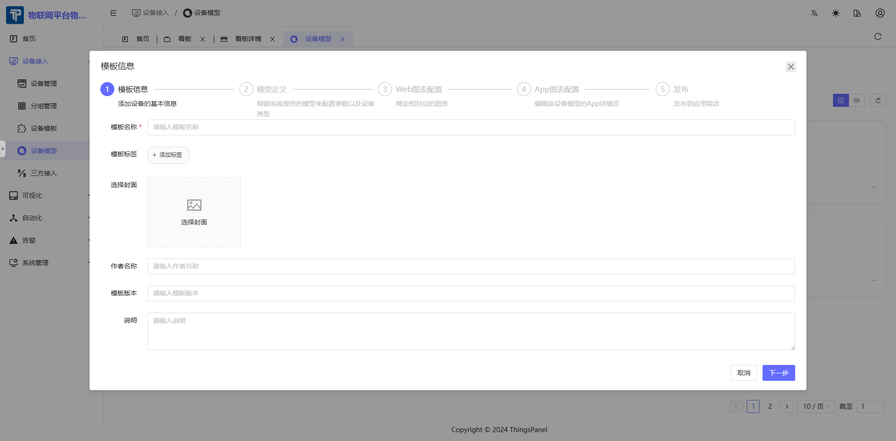
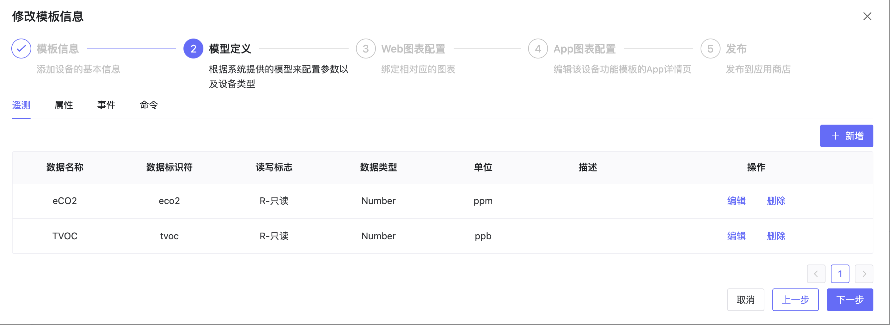
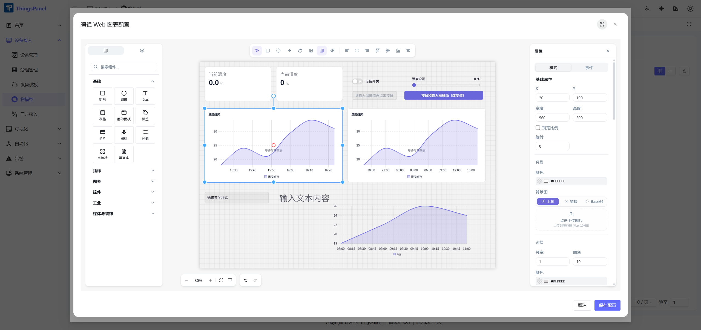

# Thing Model

A Thing Model defines reusable device fields and the Web/App chart pages that are generated from those fields. Device templates can reference a Thing Model so devices of the same type share the same data structure and visualization configuration.

## 1. Description

- Go to **Device Onboarding** > **Thing Model** to open the Thing Model management page.
- A Thing Model usually represents a real device type, such as a temperature and humidity sensor.
- The model definition contains telemetry, attributes, events, and commands. These fields can be used as data sources in chart configuration.
- Web Chart Configuration and App Chart Configuration use the ThingsVis editor to create previewable visualization pages.
- The saved chart configuration is applied when devices using this model display their details page.

## 2. Operations

### 2.1 Create a Thing Model

- Click **Add Thing Model**.
- Enter the name, tag, author, version, description, icon, and other basic information.

### 2.2 Define the Thing Model

- Configure the data name, identifier, data type, unit, description, and read/write settings for telemetry and attributes.
- Configure events and commands when the device needs event reporting or platform-issued control instructions.
- Save the model definition before entering the chart configuration steps.

### 2.3 Configure Web Charts

The Web chart step is configured through the embedded ThingsVis preview and editor. The **Thing Model Configuration DEMO** shows the current workflow.

- In the edit dialog, go to step **3 Web Chart Configuration**.
- Select the refresh interval at the top of the card. In the DEMO, the interval is set to **5 seconds**.
- The center area displays the current Web chart page as a ThingsVis preview. In the DEMO, it includes temperature trend, humidity trend, device switch, temperature setting, current temperature, and current humidity widgets.
- Click **Edit Configuration** to open the ThingsVis editor.

- In the editor, use the left component library to add widgets, adjust the canvas in the center, and configure the selected page or widget in the right property panel.
- When binding data, select the fields from the current Thing Model, such as `temperature`, `humidity`, and `switch`.
- Click **Save Configuration** to save the page back to the Web chart configuration. Click **Cancel** only when you do not want to save the changes.
- After saving, the Web chart step returns to the preview. Confirm the preview is correct, then click **Next Step**.

#### Data binding examples

Select a widget on the canvas, or switch to **Layers** and select the target widget by name. The selected widget's binding options are shown in the right property panel.

For a trend chart, select a line chart widget, such as `chart/uplot`. In **Content**, configure the chart title and display options. In **Data**, set the dataset binding mode to **Field**, set **Data Range** to **Device Data**, set **Data Type** to **Historical Data**, and select a historical array field such as `temperature__history` or `humidity__history`. Configure the time range, aggregation function, aggregation window, smooth curve, and area fill as needed.

For a value card, select `interaction/value-card`. Set the card title, then set the value binding mode to **Field**. Use **Device Data** as the data range, **Thing Model Field** as the data type, and select a numeric field such as `humidity` or `temperature`. Configure the unit, whether to show the unit, the decimal places, and optional trend or icon display.

For a switch, select `interaction/switch`. Set **Switch Status** to **Field**, use **Device Data** as the data range, select **Thing Model Field**, and bind it to a Boolean field such as `switch`. Configure the label text, label position, on/off text, size, colors, and behavior options such as disabled state or confirmation before switching.

### 2.4 Configure App Charts

The App chart step also uses the ThingsVis editor, but the result is saved separately for the mobile App detail page.

- Go to step **4 App Chart Configuration**.
- Select the refresh interval for the App detail page.
- Click **Create Configuration** or **Edit Configuration** to open the editor.
- Design the mobile detail page and bind widgets to telemetry or attribute fields from the Thing Model.
- Click **Save Configuration** to save the App chart page and return to the preview.
- Click **Next Step** to enter the publish step.

### 2.5 Complete and Publish

- Review the Thing Model information, model definition, Web chart configuration, and App chart configuration.
- Publish the model after confirming that the configuration is correct.
