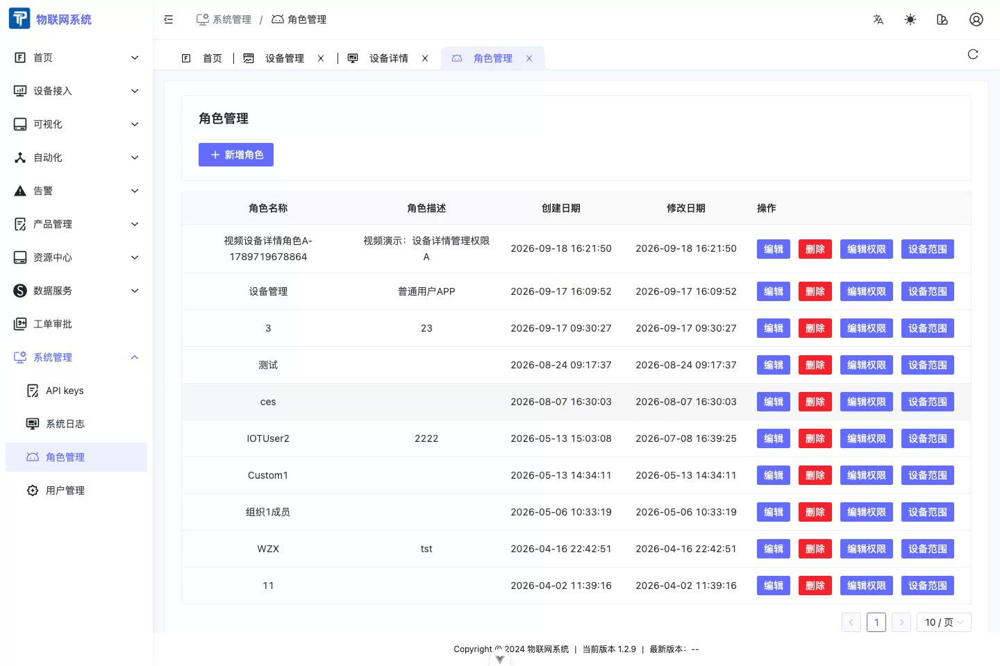

# Role Management

:::info Version scope
Tenant users, roles, and per-device permissions described here are Enterprise Edition features. The Community Edition is single-tenant and does not provide tenant-level user management or per-user device assignment.
:::

- Role management allows adding users, editing users, editing permissions, and deleting users.

## Edit Permissions
- Select a role and click Edit Permissions to edit the left-menu, page, and feature permissions visible to that role.
- Role permissions determine whether a user can enter device management, open device details, and use actions such as Edit. They do not determine which specific devices the user can see.

## Device Scope Permissions

- In the Enterprise Edition, configure device data scope on the Users tab of device details. Associate the user with the device and then set the device permission.
- **Manage (including read)** allows the user to read data from and manage the device.
- A user sees only associated devices. If users A and B are each associated with a different device and given **Manage (including read)**, they can manage their own devices without seeing each other's devices.
