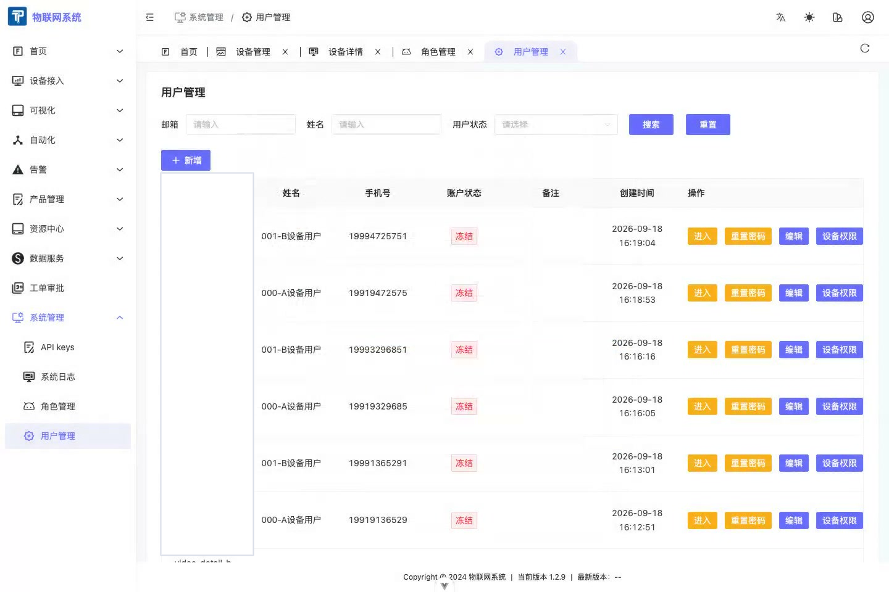

# User Management

:::info Version scope
User management and per-device authorization described here are Enterprise Edition features. The Community Edition is single-tenant and does not provide tenant-level multi-user capability.
:::

- User management allows adding and editing users under the tenant, resetting passwords for users, entering user accounts (quick login) from the tenant account, and deleting users.
- A user's page and feature permissions come from roles. Configure the user's device data scope separately on the Users tab of device details.
- In the Enterprise Edition, users see a device only after they are associated with it; **Manage (including read)** allows them to read and manage that device.

