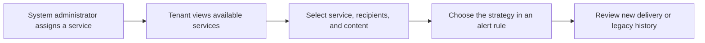

# Notification strategies

Use a notification strategy to choose an administrator-configured service, its recipients, and the content used for an alert. The page keeps the existing route `/alarm/notification-group`, while the user-facing label is **Notification Strategy**.

## 1. Create a strategy

1. Open **Alerts → Notification Strategy**.
2. Review the services available to your tenant. Only services configured and assigned by a system administrator appear. Provider credentials are not available in the tenant interface.

*Development-environment screenshot. The shown SMTP instance is disabled; this image illustrates the read-only service list and does not show a sendable account.*

3. Select **Create Notification Strategy** and enter the strategy details, target, and message content supported by the selected service.
4. Save and reopen the strategy to confirm its values. Saving or validating a strategy does not send a message.
5. Open the alert rule and select the strategy that should handle that alert.

A strategy is used when an alert rule selects it. Do not assume that creating a strategy automatically applies it to every alert or creates a platform-wide inherited default.

## 2. Test only when needed

Sending a test is an actual provider submission. Check the recipient, message, and any charge before confirming. A save or configuration check does not send anything.

| Status | Meaning |
|---|---|
| Queued | The notification intent has been durably queued. |
| Accepted | The provider accepted the request; delivery is not confirmed. |
| Delivered / Failed | A trusted provider receipt reported this final status. |
| Unknown | The provider outcome could not be confirmed. Do not blindly send again. |
| Accepted without receipt | The provider accepted the request, but this channel does not provide a delivery receipt. |

## 3. Review notification records

Open **Alerts → Notification Records**. New deliveries and legacy history are shown as separate record sets. Legacy `SUCCESS` or `FAILURE` values describe the old system's status and are not proof of recipient delivery.

## 4. Legacy notification groups

The legacy group maintenance tab has been removed. Creating, editing, or deleting a legacy notification group is no longer supported. Existing group lists/details remain available for read-only compatibility, and the underlying historical records are retained. Do not use an old group's former edit flow to configure a new strategy.

## 5. Tenant access

Community Edition does not provide a tenant sub-user or tenant role-administration workflow for notification strategies. Your available services and records are determined by the current tenant session. Contact a system administrator if a required service is missing; do not enter provider secrets in a tenant form.

For provider integration source code and the plugin contract, see the [plugin developer guide](../../../developer-guide/notification-plugin.md).
