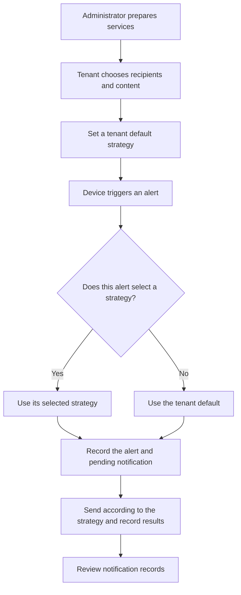

# Notification strategies

A strategy says which service to use, whom to notify, and what to send when an alert occurs. The administrator prepares service accounts; the tenant configures strategies and can set one tenant-wide default.

## 1. Create a strategy

1. Open **Alerts → Notification Strategy** and review available services. Tenants can inspect service details but cannot view or change provider secrets.

*Page example. The pictured account is disabled; check that your service is available before using it.*

2. Select **Create Notification Strategy**, choose a service, and enter the recipients and message.
3. Save and reopen it to confirm the values. Saving or validating does not send a message.
4. Select **Enable strategy** to make it available for alerts. Resolve any reported error; a saved strategy is not necessarily ready for use.

## 2. Set the tenant default

1. Find **Tenant default notification strategy** on the strategy page.
2. Select a strategy available for alerts, save it, and refresh to confirm it persisted.
3. In alert rules, choose **Use tenant default strategy**. Alerts without a separately selected strategy use the current tenant default when triggered.

*Actual page screenshot using a demonstration strategy name. Saving a default policy does not send a notification.*

For example, set an operations email strategy once for ordinary alerts. Select a different strategy in the rule for an important device that needs different recipients.

- An explicitly selected strategy takes precedence.
- Without a default, the alert is recorded but no notification is sent.
- An unavailable or disabled strategy stops sending and records a reason; it does not silently switch to another strategy.
- Changing the default affects future alerts, not already queued notifications.
- If another save changed the configuration, refresh and review it before saving again.

## 3. Set an exception for an alert

Edit the alert rule, select a specific strategy, and save. To return to the tenant default, select **Use tenant default strategy** and save.

*Actual alert-rule form. Select Use tenant default policy to inherit the default when the alert triggers. The strategy name is demonstration data.*

## 4. Test and review results

Use **Send test** only after checking the recipient and content. It submits a real message and may incur charges. Verify the actual receiving endpoint as well as the provider result.

Open **Alerts → Notification Records**. **Accepted** means the provider accepted the request, not that the recipient received it. SMTP usually provides no final delivery receipt; check both the inbox and spam folder.

Recording the alert and its pending notification lets processing continue after an outage or restart. Sending according to the strategy and recording results makes each target's outcome visible.

## 5. Access and extensions

Administrators own service accounts and provider secrets. Tenants configure their strategies and default settings. Community Edition has no tenant sub-user administration workflow. Contact the administrator for missing services.

See the [plugin developer guide](../../../developer-guide/notification-plugin.md) to add services.

Recording the alert and pending notification keeps the event and message safe so processing can continue after a network outage or service restart. Sending according to the strategy and recording the result lets you inspect the result for each target.
