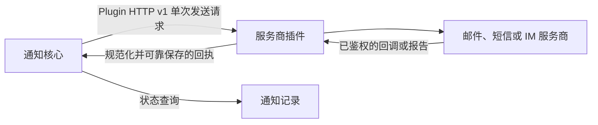

# 开发通知插件

通知插件把平台通知核心连接到外部服务商。通知核心负责租户权限、服务商账号选择、通知策略、调度、重试和投递记录；插件负责实现一个服务商适配，可独立运行，不要求使用 Encore。



## 1. 实现插件接口

每个插件对外提供经过鉴权的 HTTP 服务：

| 接口 | 用途 |
|---|---|
| `GET /v1/manifest` | 返回版本化插件清单，不得发送消息。 |
| `POST /v1/validate` | 校验服务账号配置，不得发送测试消息。可以进行有时限、只读的凭据检查。 |
| `POST /v1/send` | 对一个投递目标进行一次有界提交尝试。 |
| `GET /healthz` | 检查进程和服务商的基本可用状态，不得发送消息。 |

Manifest 描述 `api_version`、`plugin_id`、插件版本、渠道、内容模式、配置和目标 schema、密钥字段、可选账号身份字段及送达回执能力。只声明插件确实实现的能力。

## 2. 校验嵌入式 schema

配置和接收目标约束使用嵌入式 JSON Schema Draft 2020-12 文档。通知核心不另设关键字白名单，按 Draft 2020-12 校验嵌入式 schema，并拒绝加载外部网络或文件 `$ref`。网页配置表单支持的 schema 关键字与控件比 Core validator 更少，因此 Core 能编译的 schema 不一定能在界面中编辑。登记前应在目标 Core 编译 schema，并在目标 UI 逐个字段测试。

把凭据列在顶层 `secret_fields` 中。密钥只写入、不回显，不能通过 manifest 或校验响应返回。`identity_fields` 只列出稳定的服务商账号身份字段；修改这些字段可能相当于更换账号身份。

## 3. 准确返回发送结果

插件发送结果区分三种情况：

- `accepted`：服务商确认受理了提交，不证明消息已经送达。
- `rejected`：插件能够证明服务商没有受理本次尝试。
- `unknown`：服务商可能已执行副作用，但当前无法确认结果。

开始写入后发生超时或断连，不能当作明确拒绝。不要自动重试结果不确定的发送；平台请求中的 ID 不一定是服务商侧幂等键。如果插件返回 `accepted` 但不提供回执，界面不能把状态显示为已送达。

## 4. 安全处理回执

服务商支持回调或报告时，先验证原始服务商事件，将其规范化为带稳定标识的回执事件，并在确认/删除服务商消息前可靠保存。使用专用回执凭据把回执提交给通知核心；只有 Core 确认已可靠接收后，才能确认或删除源事件。使用稳定事件 ID，确保回调重放不会重复记账。

只有完整验证了服务商鉴权、可靠缓冲、Core 鉴权和确认流程后，才能声明支持送达回执。单独测试解析器或 mock 回调不等于端到端回执通过。

## 5. 安全访问服务商

- 插件监听地址应位于可信内网，并对每个接口鉴权。
- 仅连接该插件配置允许的服务商地址；使用 TLS，并限制连接、响应和总超时时间。
- 对不可幂等的服务商写操作禁用自动重试和重定向。
- 限制请求与响应大小。在请求访问服务商前，拒绝重复 JSON key、未知字段、契约不允许的显式 `null` 和已过期任务。
- 不记录凭据、完整收件目标、消息正文或原始服务商响应正文。

## 6. 测试和打包

使用本地服务商 fixture 验证：校验流程不发送、受理与拒绝结果、写入后断连的不确定性、错误或超大响应、密钥脱敏及回执重放。离线运行测试、静态检查和构建后再打包。每个独立插件模块应固定 SDK 源码和契约版本。

## 7. 已公开的仓库

插件 SDK 和以下服务商适配器已作为独立公开仓库发布：

| 项目 | 仓库 | 范围 |
|---|---|---|
| 插件 SDK 与无发送模板 | [thingspanel-notification-plugin-sdk](https://github.com/ThingsPanel/thingspanel-notification-plugin-sdk) | 可移植 Go SDK、契约和起步模板。 |
| SMTP 邮件 | [thingspanel-notification-smtp](https://github.com/ThingsPanel/thingspanel-notification-smtp) | SMTP 服务商适配器。 |
| 钉钉群机器人 | [thingspanel-notification-dingtalk](https://github.com/ThingsPanel/thingspanel-notification-dingtalk) | 钉钉自定义群机器人适配器。 |
| 阿里云短信 | [thingspanel-notification-aliyun-sms](https://github.com/ThingsPanel/thingspanel-notification-aliyun-sms) | 阿里云模板短信适配器。 |
| 旧签名 Webhook | [thingspanel-notification-legacy-webhook](https://github.com/ThingsPanel/thingspanel-notification-legacy-webhook) | 兼容文档定义旧消息格式的适配器。 |

仓库公开不代表插件已安装或登记到 ThingsPanel、服务商凭据已配置，也不代表消息已真实送达。自动化测试使用本地 fixture；真实服务商发送与送达回执仍需单独授权联调。

## 8. 运行无发送起步模板

SDK 仓库附带一个不会访问服务商、收到发送请求会直接拒绝的起步插件。克隆后运行测试：

```sh
git clone https://github.com/ThingsPanel/thingspanel-notification-plugin-sdk.git
cd thingspanel-notification-plugin-sdk/examples/minimal-plugin
go test ./...
```

如何修改 module 和 plugin ID、实现 manifest 与服务商、测试打包以及准备登记流程，请看 SDK 的[开发指南](https://github.com/ThingsPanel/thingspanel-notification-plugin-sdk/blob/main/docs/DEVELOPMENT.md)。起步模板不会发送消息，也不能验证真实服务商送达。
