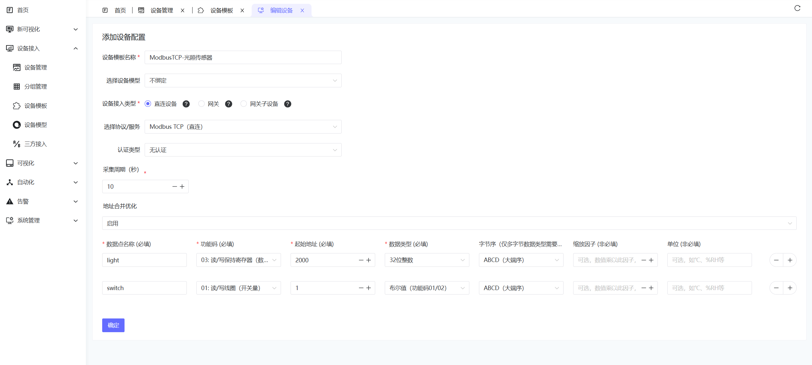
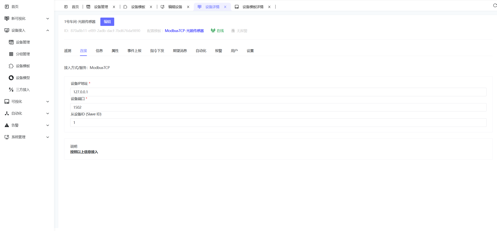

# Modbus TCP直连接入

## 1. 功能概述

ThingsPanel的Modbus TCP接入服务支持直接连接工业设备，自动采集数据并上报平台。主要特性：

- **可视化配置**：Web界面配置设备参数和数据地址表
- **智能轮询**：灵活的数据采集策略和周期配置
- **设备控制**：支持线圈和寄存器的写入控制
- **连接管理**：自动重连、连接池管理、状态监控

## 2. 快速开始

前提：已部署ModbusTCP直连接入服务并注册到平台

### 2.1 准备设备信息

配置前需要收集以下设备信息：

| 参数 | 说明 | 示例 |
|------|------|------|
| IP地址 | 设备IP地址 | 192.168.1.100 |
| 端口 | Modbus TCP端口 | 502 |
| 从站ID | 设备SlaveID | 1 |
| 数据地址 | 寄存器地址范围 | 40001-40010 |

### 2.2 创建设备模板



1. 进入 设备接入-设备模板
2. 选择设备接入类型：直连设备
3. 选择Modbus TCP（直连），认证类型选择无认证
4. 填写采集周期、是否启用地址合并优化
5. 配置采集参数，参数说明如下

| 配置项 | 说明 | 示例 |
|--------|------|------|
| 数据点名称 | 唯一标识 | temperature |
| 功能码 | Modbus功能码 | 03（读保持寄存器） |
| 起始地址 | 寄存器地址 | 40001 |
| 数据类型 | 数据解析类型 | Float32 |
| 字节序 | 大小端 | 大端 |
| 缩放系数 | 可选，数值缩放 | 0.1 |
| 单位 | 可选 | °C |


### 2.3 创建设备

 

1. 进入 设备接入 -**设备管理** → **添加设备**
2. 填写设备名称，选择设备类型：上一步创建的设备模板
3. 进入设备详情，选择接入页签，填写设备IP地址、设备端口、从设备ID 保存


```
设备IP：192.168.1.100
端口：502
从站ID：1
```

## 3. 数据地址表配置

### 3.1 添加数据点

点击 **数据地址表** → **添加数据点**，配置采集参数：

| 配置项 | 说明 | 示例 |
|--------|------|------|
| 数据点名称 | 唯一标识 | temperature |
| 功能码 | Modbus功能码 | 03（读保持寄存器） |
| 起始地址 | 寄存器地址 | 40001 |
| 数据长度 | 寄存器数量 | 2 |
| 数据类型 | 数据解析类型 | Float32 |
| 字节序 | 大小端 | 大端 |
| 缩放系数 | 数值缩放 | 0.1 |

### 3.2 支持的功能码

| 功能码 | 说明 | 地址范围 |
|--------|------|----------|
| 01/05 | 读/写线圈状态 | 00001-09999 |
| 02 | 读写离散输入 | 10001-19999 |
| 03/06 | 读/写保持寄存器 | 40001-49999 |
| 04 | 读输入寄存器 | 30001-39999 |

### 3.3 数据类型

| 类型 | 占用寄存器 | 说明 |
|------|------------|------|
| Bool | 1 | 布尔值 |
| Int16 | 1 | 16位有符号整数 |
| UInt16 | 1 | 16位无符号整数 |
| Int32 | 2 | 32位有符号整数 |
| UInt32 | 2 | 32位无符号整数 |
| Float32 | 2 | 32位浮点数 |
| Float64 | 4 | 64位浮点数 |

## 4. 设备控制

### 4.1 支持的控制类型

- **线圈控制**：功能码05（单个线圈）
- **寄存器控制**：功能码06（单个寄存器）、16（多个寄存器）


### 4.2 控制操作

从平台可以对设备进行实时控制，按照配置的数据点名称下发控制指令：

```json
{
  "temperature": 15.2,
  "switch": 1,
  "speed": 1200
}
```

说明：
- `temperature`：设置目标温度值
- `switch`：控制开关状态（0=关，1=开）

## 5. 故障排除

### 5.1 常见问题

| 问题 | 可能原因 | 解决方案 |
|------|----------|----------|
| 设备无法连接 | 网络不通、IP地址错误 | 检查网络连接，确认设备IP |
| 数据读取失败 | 地址配置错误、功能码不支持 | 检查寄存器地址和功能码 |
| 数据异常 | 数据类型错误、字节序设置错误 | 确认数据类型和字节序设置 |
| 控制失败 | 设备不支持写操作、权限不足 | 检查设备写权限和功能码支持 |

### 5.2 调试建议

1. **逐步配置**：先配置少量数据点，确认正常后再增加
2. **使用工具**：可使用Modbus调试工具验证设备通信
3. **查看日志**：检查系统日志获取详细错误信息
4. **网络测试**：使用ping命令测试网络连通性

## 6. 性能优化

### 6.1 地址合并优化

启用地址合并优化可以提高采集效率：

- **连续地址**：系统会自动合并连续的寄存器地址
- **减少请求**：减少Modbus请求次数，提高响应速度
- **建议**：将相关数据点配置在连续的地址范围内

### 6.2 采集周期设置

根据实际需求设置合适的采集周期：

- **高频数据**：重要参数可设置较短周期（1-5秒）
- **普通数据**：一般参数设置中等周期（10-30秒）
- **状态数据**：变化较少的参数可设置较长周期（60秒以上）

## 参考实例

[ThingsPanel物联网平台直连ModbusTCP设备【视频】](https://www.bilibili.com/video/BV1gJnAzfEk2/?spm_id_from=333.1387.homepage.video_card.click)