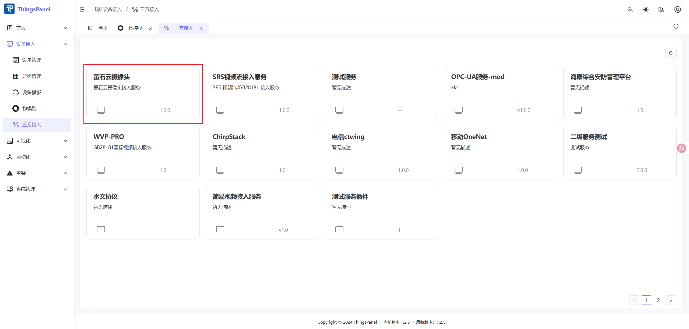
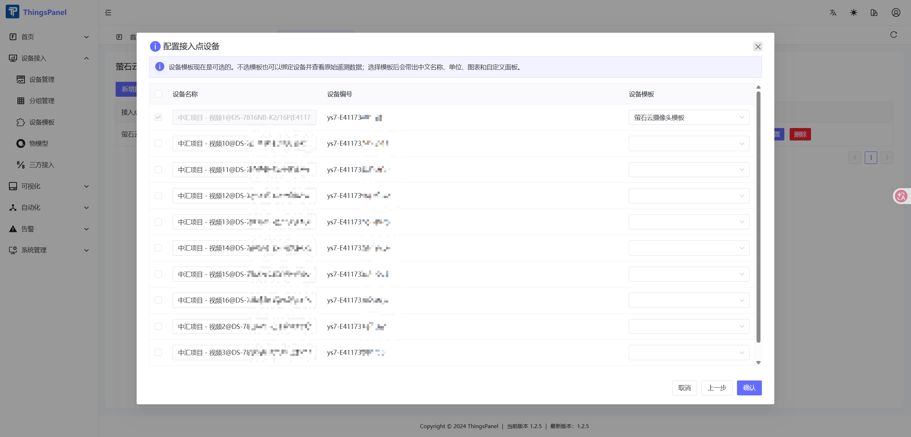

# 萤石云视频接入

ThingsPanel 通过 ThingsVis 的 **萤石云播放器（EZVIZ Player）** 接入萤石云摄像头。

完整接入顺序如下：

```text
确认萤石云第三方接入服务
  → 创建摄像头物模型并配置 Web 图表
  → 创建设备模板并关联物模型
  → 设备模板选择“萤石云摄像头”服务
  → 从萤石云服务添加并关联设备
  → 在设备详情页验证实时播放和回放
```

## 1. 准备萤石开放平台信息

开始配置前，请准备以下信息：

- 设备已经接入萤石云平台
- 萤石云开放平台应用的 AppKey 和 Secret

## 2. 配置萤石云第三方接入

访问 **设备接入 → 三方接入**。

### 2.1 选择萤石云摄像头服务

在第三方接入服务列表中找到并单击 **萤石云摄像头**，其说明为“萤石云摄像头接入服务”。如果列表中没有该服务，需要先安装或部署萤石云连接器，不能直接创建萤石云设备。



### 2.2 进入接入点列表

进入“萤石云摄像头”服务详情后，页面会显示已经创建的接入点。可以在此执行以下操作：

- 单击 **新增接入** 创建新的萤石云接入点；
- 单击 **查看设备** 查看接入点同步到的摄像头；
- 单击 **修改配置** 更新接入点参数；
- 不再使用的接入点可以删除，删除前应确认其关联设备已经迁移。

同一个萤石开放平台应用通常配置为一个接入点。需要隔离不同项目、应用或账号时，可以分别创建多个接入点。


### 2.3 新增接入点并填写萤石云参数

单击 **新增接入**，在“新增接入点”窗口中填写：

| 配置项 | 是否必填 | 说明 |
| --- | --- | --- |
| 接入点名称 | 是 | 用于在 ThingsPanel 中区分不同萤石云应用或项目 |
| 选择模式 | 是 | 手动模式由用户选择需要接入的设备；自动模式按服务规则同步设备 |
| 应用密钥（AppKey） | 是 | 萤石开放平台应用的 AppKey |
| 应用 Secret | 是 | 与 AppKey 对应的 Secret，只用于服务端鉴权 |
| AccessToken | 否 | 留空时由服务端通过 AppKey/Secret 获取；手工填写后，Token 到期需要手动更新 |
| 码流质量 | 否 | 按实际网络和画质需求选择 |
| 流地址刷新间隔 | 否 | 萤石云播放地址的刷新周期，通常使用默认值 |
| 告警轮询间隔 | 否 | 未配置告警 Webhook 时，用于轮询告警数据 |
| 告警 Webhook 公开地址 | 否 | 配置后由萤石云主动推送告警，需要填写外网可访问的地址 |

确认 AppKey 和 Secret 来自同一个萤石开放平台应用后，单击 **保存并下一步**，继续选择要接入的摄像头和对应设备模板。


AppKey、Secret 和 AccessToken 都属于敏感信息。文档截图、日志和问题反馈中必须完整打码，不要只遮挡其中一部分字符。

萤石云第三方接入服务负责连接萤石开放平台、同步摄像头，并维护设备的在线状态和播放参数；ThingsVis 萤石云播放器负责在设备详情页展示实时视频和录像回放。

## 3. 创建摄像头物模型

进入 **设备接入 → 物模型**，单击 **新建物模型**，名称可填写为“萤石云摄像头模板”。


在 **模型定义 → 属性** 中添加以下字段：

| 数据名称 | 标识符 | 数据类型 | 读写标志 | 是否必填 | 说明 |
| --- | --- | --- | --- | --- | --- |
| 萤石 AccessToken | `ys7_play_access_token` | String | 读写 | 是 | 由服务端从萤石开放平台获取并定期刷新 |
| 萤石设备序列号 | `ys7_device_serial` | String | 只读 | 是 | 萤石设备序列号，例如 `J33497352` |
| 萤石通道号 | `ys7_channel_no` | Number | 只读 | 是 | 单通道设备通常填写 `1`，支持 `1`～`32` |
| 设备验证码 | `validCode` | String | 只读 | 否 | 启用了视频加密的设备需要填写 |

物模型只定义字段结构，不要在模板说明、截图或前端代码中写入真实 `accessToken`。

设备属性示例：

```json
{
  "ys7_play_access_token": "由服务端获取的有效令牌",
  "ys7_device_serial": "J33497352",
  "ys7_channel_no": 1,
  "validCode": "仅加密设备填写"
}
```

## 4. 配置 Web 图表

完成模型定义后进入 **Web 图表配置**：

1. 添加 **萤石云播放器（EZVIZ Player）**；
2. 在播放器的“连接”配置中，将 `Access Token` 绑定到物模型字段 `ys7_play_access_token`；
3. 将“设备序列号”绑定到 `ys7_device_serial`；
4. 将“通道号”绑定到 `ys7_channel_no`；
5. 如果设备启用了视频加密，将“设备验证码”绑定到 `validCode`；
6. 播放模板建议选择“安防监控”，清晰度按网络情况选择高清或标清；
7. 保存 Web 图表配置并完成物模型创建。

下图展示了播放器与物模型字段的绑定位置：


### 回放存储类型

“回放存储类型”决定播放器从哪里读取历史录像：

| 类型 | 录像来源 | 使用条件 | 相关配置 |
| --- | --- | --- | --- |
| SD 卡 | 摄像头本地存储卡 | 摄像头已安装并启用 SD 卡，查询时间段内存在录像 | 不需要填写云录像空间 ID 和 `busType` |
| 云存储 | 萤石云录像空间 | 设备已开通萤石云存储服务，当前应用和 `accessToken` 具有录像访问权限 | 按萤石开放平台返回的信息填写云录像空间 ID；需要区分业务类型时填写 `busType` |

一般情况下，设备使用本地存储卡录像时选择 **SD 卡**；只有确认设备已经开通萤石云存储时才选择 **云存储**。

- **云录像空间 ID（spaceId）**：萤石云录像空间的标识。未使用指定录像空间，或萤石接口没有返回该参数时可以留空。
- **云录制 busType**：云录像的业务类型标识。仅在萤石开放平台接口或项目配置明确提供该值时填写，不要自行猜测。
- 切换存储类型后，应保存 Web 图表配置，再到设备详情页选择一个确实存在录像的时间段验证回放。
- 实时视频播放不受此选项影响；该配置只影响“回放”功能生成的录像地址。

播放器会根据绑定字段生成实时播放地址，例如：

```text
ezopen://open.ys7.com/J33497352/1.hd.live
```

通常不需要手工填写 `ezopen://` 地址；只有兼容旧配置时才使用播放器提供的“ezopen 兜底地址”。

## 5. 创建设备模板并关联萤石云服务

进入 **设备接入 → 设备模板**，新建或编辑“萤石云摄像头模板”，并完成以下配置：

1. **设备模板名称**：填写便于识别的名称，例如“萤石云摄像头模板”；
2. **选择物模型**：选择前面创建并配置好 Web 图表的摄像头物模型；
3. **设备接入类型**：选择 **直连设备**；
4. **选择协议/服务**：必须选择 **萤石云摄像头**；
5. 单击 **确定** 保存设备模板。


仅关联物模型还不够。如果“选择协议/服务”没有设置为“萤石云摄像头”，该模板不会使用萤石云第三方接入服务，服务同步的摄像头也无法按预期绑定到此模板。


## 6. 从萤石云服务添加并关联设备

返回 **设备接入 → 三方接入**，打开 **萤石云摄像头**服务，根据服务页面提示完成萤石开放平台授权或服务参数配置。

服务连接成功后，选择需要接入的萤石摄像头，并将设备关联到刚才创建的“萤石云摄像头模板”。完成后可在设备模板详情的 **关联设备** 页签查看已接入设备、设备编码和在线状态。

接入过程中请确认：

- 设备模板关联的是正确的摄像头物模型；
- 设备模板的协议/服务为“萤石云摄像头”；
- 同步后的设备编码包含正确的设备序列号和通道信息；
- 设备状态显示为“在线”。



## 7. 检查设备属性

创建或编辑摄像头设备，将设备模板设置为“萤石云摄像头模板”，然后向设备写入 `ys7_play_access_token`、`ys7_device_serial`、`ys7_channel_no` 等属性。

如果令牌由连接器维护，连接器应在令牌刷新后重新上报 `ys7_play_access_token`。不要依赖人工长期维护令牌，否则令牌失效后播放器将无法继续播放。

## 8. 验证播放效果

打开 **设备管理 → 设备详情 → 图表**。播放器显示实时画面，且设备状态为“在线”，说明接入成功。


播放器还支持实时/回放切换、静音、截图、录屏、电子放大、清晰度切换和全屏等功能。录像回放默认读取设备 SD 卡；使用萤石云存储时，还需要在播放器中配置云存储相关参数。

## 9. 常见问题

### 播放器提示缺少绑定信息

检查 `ys7_play_access_token`、`ys7_device_serial` 和 `ys7_channel_no` 是否均已绑定到播放器，并确认设备属性已经有值。

### 提示 Token 无效或播放一段时间后失效

在服务端使用 AppKey 和 Secret 重新申请 `accessToken`，然后更新设备属性。不要在浏览器端使用 Secret 申请令牌。

### 加密设备无法播放

确认已在物模型中添加 `validCode`，并写入设备机身标签上的验证码。

### 设备序列号和通道号正确但仍无法播放

检查设备是否在线、是否已添加到对应萤石开放平台账号，以及应用是否具备该设备的视频播放权限。
