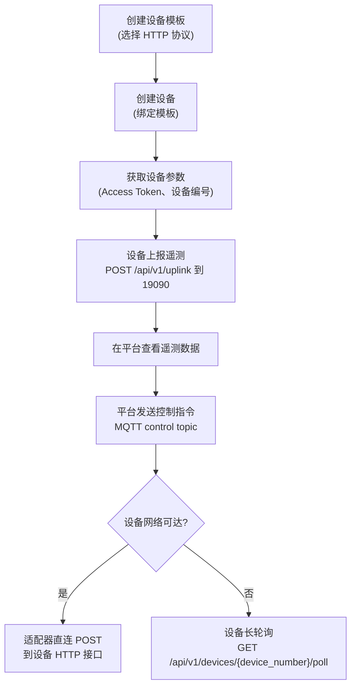

# HTTP 设备接入

HTTP 协议接入支持不具备原生 MQTT 能力的设备，通过标准 HTTP 请求与 ThingsPanel 交换数据。设备通过 HTTP 适配器上报遥测数据，ThingsPanel 通过 MQTT 下发指令或控制，适配器支持直连 HTTP 下行和设备长轮询两种模式。

## 仓库地址

[ThingsPanel/thingspanel-adapter-http](https://github.com/ThingsPanel/thingspanel-adapter-http)

## 前置条件

按照 [官方安装指南](http://install.thingspanel.io/) 部署社区版（自带 HTTP 设备接入服务），或通过源码部署 ThingsPanel。源码部署完成后，需要在**系统管理员**后台注册 HTTP 接入插件后再使用。

## 端口职责

| 端口 | 归属 | 用途 |
|---|---|---|
| `19090` | HTTP 适配器 | 设备侧接口：上报、poll、ack |
| `19091` | HTTP 适配器 | 平台回调接口和健康检查接口 |
| `8080` | 设备侧 | 默认直连下行接收端口，用于 `/api/v1/control` 和 `/api/v1/command` |

设备上报、长轮询、ack 都走 `19090`。平台回调走 `19091`。

## 设备身份

设备自身使用 `device_number` 标识，例如 `D001`。平台内部的 `device_id` 由 ThingsPanel 分配，适配器查询设备配置后才会拿到。设备上报数据和长轮询 URL 都应该使用 `device_number`，不要使用平台内部 `device_id`。

## 操作流程图



## 接入步骤

### 创建设备模板

1. 登录租户，进入**设备接入** -> **设备模板**，点击**创建模板**，选择**直连设备** -> **HTTP协议**，保存。


### 创建设备

1. 进入**设备接入** -> **设备管理**，点击**添加设备**，选择刚才创建的 HTTP 协议设备模板。


2. 填写 Access Token（每个设备需要唯一），保存。


3. 进入设备详情页，点击**编辑**按钮，查看并记录**设备编号**。设备上报、长轮询和平台下发控制时都使用该编号。


### 发送遥测数据

设备通过 HTTP POST 向适配器的上行接口发送数据。将 `YOUR_ACCESS_TOKEN` 和 `YOUR_DEVICE_NUMBER` 替换为实际值。

```bash
curl -X POST http://127.0.0.1:19090/api/v1/uplink \
  -H "Content-Type: application/json" \
  -H "Access-Token: YOUR_ACCESS_TOKEN" \
  -d '{
        "device_number": "YOUR_DEVICE_NUMBER",
        "temp": 25.5,
        "hum": 60.2,
        "status": "active"
      }'
```

:::info 请求格式说明
| 字段 | 说明 |
|---|---|
| `Access-Token` 请求头 | 平台中配置的设备 Access Token |
| `device_number` 请求体 | 平台分配的设备编号，例如 `D001` |
| JSON 请求体 | 任意遥测数据键值对 |
:::

## 下行模式

### 直连模式

适用于设备或中间件有公网 IP、网络可达的场景。

在设备凭证里填写可选 `downlinkHost` 后，适配器会直连：

```text
POST http://downlinkHost:8080/api/v1/control
POST http://downlinkHost:8080/api/v1/command
```

控制请求体：

```json
{
  "tp_device_number": "D001",
  "values": {
    "xx": 11
  }
}
```

指令请求体：

```json
{
  "tp_message_id": "msg-001",
  "tp_device_id": "platform-device-id",
  "tp_device_number": "D001",
  "method": "set",
  "params": {}
}
```

设备侧必须启动 HTTP 服务并监听配置的下行路径。只会上报数据的客户端不会收到直连控制指令。

### 长轮询模式

适用于设备在 NAT 后面、适配器无法主动访问设备的场景。

如果 `downlinkHost` 为空，下行消息会进入队列，等待设备主动 poll。若配置了直连模式但直连请求失败，适配器也会把消息转入长轮询队列兜底。

```text
GET http://适配器地址:19090/api/v1/devices/{device_number}/poll
```

poll 最长等待 30 秒。

没有待下发消息时返回：

```json
{
  "commands": []
}
```

有待下发 command 时返回：

```json
{
  "commands": [
    {
      "type": "command",
      "device_number": "D001",
      "message_id": "msg-001",
      "method": "set",
      "params": {}
    }
  ]
}
```

设备执行 poll 到的 command 后回传结果：

```text
POST http://适配器地址:19090/api/v1/devices/{device_number}/commands/{message_id}/ack
```

```json
{
  "ok": true,
  "data": {}
}
```

设备 poll 和 ack 使用设备凭证里的 `accessToken` 鉴权，可通过 `X-Api-Key`、`Access-Token` 或 `Authorization: Bearer <token>` 传入。

### 平台控制 Topic

平台通过插件 MQTT topic 向 HTTP 设备发送控制消息：

```text
plugin/HTTP/devices/telemetry/control/<device_number>
```

示例：

```text
plugin/HTTP/devices/telemetry/control/D001
```

Payload：

```json
{
  "xx": 11
}
```

## 表单配置

插件会向前端返回两组设备配置字段：

| 分组 | 字段 | 说明 |
|---|---|---|
| CFG | `port` | 设备直连下行端口，默认 `8080`。 |
| CFG | `controlUrl` | 设备控制路径，默认 `/api/v1/control`。 |
| CFG | `commandUrl` | 设备命令路径，默认 `/api/v1/command`。 |
| VCR | `accessToken` | 设备上报、poll、ack 鉴权使用的设备凭证。 |
| VCR | `downlinkHost` | 可选的直连下行地址。留空时使用长轮询模式。 |

## 虚拟设备测试

长轮询测试：

```powershell
go run .\cmd\virtual_device -server http://127.0.0.1:19090/api/v1/uplink -device D001 -token YOUR_ACCESS_TOKEN
```

直连下发测试：

```powershell
go run .\cmd\virtual_device -server http://127.0.0.1:19090/api/v1/uplink -device D001 -token YOUR_ACCESS_TOKEN -poll=false -listen :8080
```

直连模式下，设备凭证里的 `downlinkHost` 填 `127.0.0.1`，端口保持默认 `8080`。

## 查看设备数据

设备上报成功后，可在设备详情页查看实时数据。


## 常见问题

1. **设备不存在**：确认 ThingsPanel 中已经创建设备，并且设备编号和上报/长轮询 URL 中的 `device_number` 一致。
2. **SDK 日志显示 `deviceID` 为空**：设备上报路径是按 `device_number` 查询设备配置。SDK 日志只打印 `deviceID`，因此这里为空不代表适配器用了 `device_id` 查询。
3. **数据上报无响应**：检查 `Access Token` 是否与平台配置一致，并确认设备网络可以访问适配器上行端口 `19090`。
4. **适配器未启动**：确认设备上行端口 `19090` 未被占用（Linux: `netstat -tulpn | grep 19090`）。
5. **平台连接失败**：确认 `configs/config.yaml` 中的 `platform.url` 可以从适配器所在主机访问，并确认配置的 MQTT Broker 已启动。
6. **直连下发连接被拒绝**：确认设备侧已经启动 HTTP 服务，并监听 `downlinkHost:port/controlUrl` 或 `commandUrl`。
7. **长轮询一直返回空队列**：检查平台是否向正确的 `device_number` 下发，并确认设备凭证中 `downlinkHost` 为空，或直连模式已经失败进入队列。
