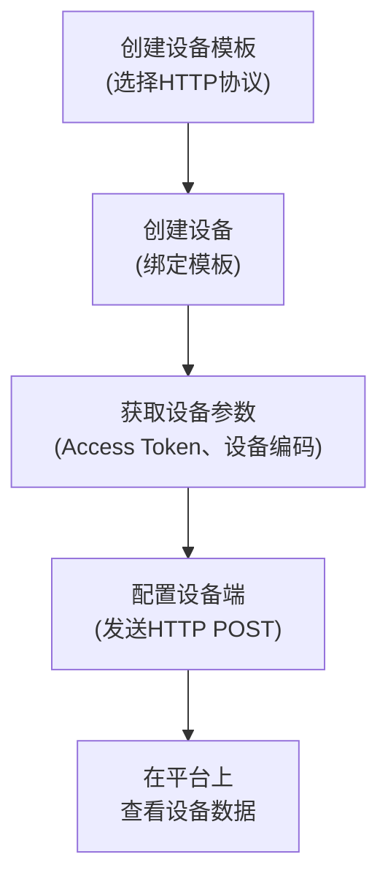
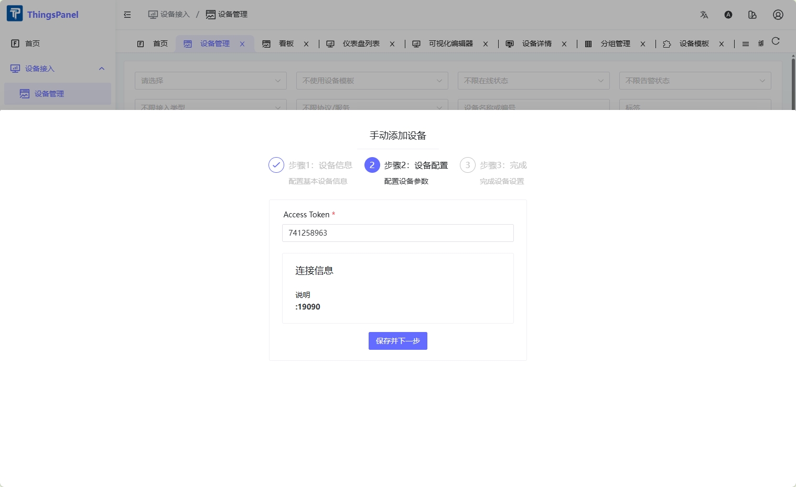

# HTTP设备接入

HTTP协议接入支持不具备原生MQTT能力的设备，通过标准的HTTP POST请求将遥测数据上报至ThingsPanel。适用于资源受限的嵌入式设备、或不便部署MQTT客户端的环境。

## 仓库地址

[https://github.com/ThingsPanel/thingspanel-adapter-http](https://github.com/ThingsPanel/thingspanel-adapter-http)

## 前置条件

按照 [官方安装指南](http://install.thingspanel.io/) 部署社区版（自带HTTP设备接入服务），或通过源码部署 ThingsPanel。（源码部署完成后，需要在**系统管理员**后台注册 HTTP 接入插件，方可使用）。

## 操作流程图



## 接入步骤

### 创建设备模板

1. 登录租户，进入【设备接入】→【设备模板】，点击【创建模板】，选择【直连设备】→【HTTP协议】，保存。


### 创建设备

1. 进入【设备接入】→【设备管理】，点击【添加设备】，选择刚才创建的 HTTP 协议设备模板。


2. 填写 Access Token（每个设备需唯一），保存。



3. 进入设备详情页，点击【编辑】按钮，查看并记录**设备编码**，该编码在设备端数据上报时使用。


### 发送遥测数据

设备通过 HTTP POST 向插件的上行接口发送数据。将 `YOUR_ACCESS_TOKEN` 和 `YOUR_DEVICE_NUMBER` 替换为实际值。

```bash
curl -X POST http://127.0.0.1:19090/api/v1/uplink \
  -H "Content-Type: application/json" \
  -H "Access-Token: YOUR_ACCESS_TOKEN" \
  -d '{
        "device_number": "YOUR_DEVICE_NUMBER",
        "temp": 25.5,
        "hum": 60.2,
        "status": "active"
      }'
```

:::info 请求格式说明
| 字段 | 说明 |
|---|---|
| `Access-Token` 请求头 | 设备 Access Token（在步骤2中配置） |
| `device_number` 请求体 | 设备编码（由平台分配，步骤3中获取） |
| JSON 请求体 | 任意遥测数据键值对 |
:::

### 查看设备数据

设备上报成功后，可在设备详情页查看实时数据。


## 常见问题

1. **数据上报无响应**：检查 `Access Token` 是否与平台配置一致，检查设备网络能否访问插件端口。
2. **插件未启动**：确认 `http_port` 端口未被占用（Linux: `netstat -tulpn | grep 19090`）。
3. **平台连接失败**：确认 `configs/config.yaml` 中 `platform.url` 地址可从插件宿主机访问。
4. **Docker 环境下数据不通**：确认设备端使用的是宿主机 IP，而非 `127.0.0.1` 或容器内部 IP。
