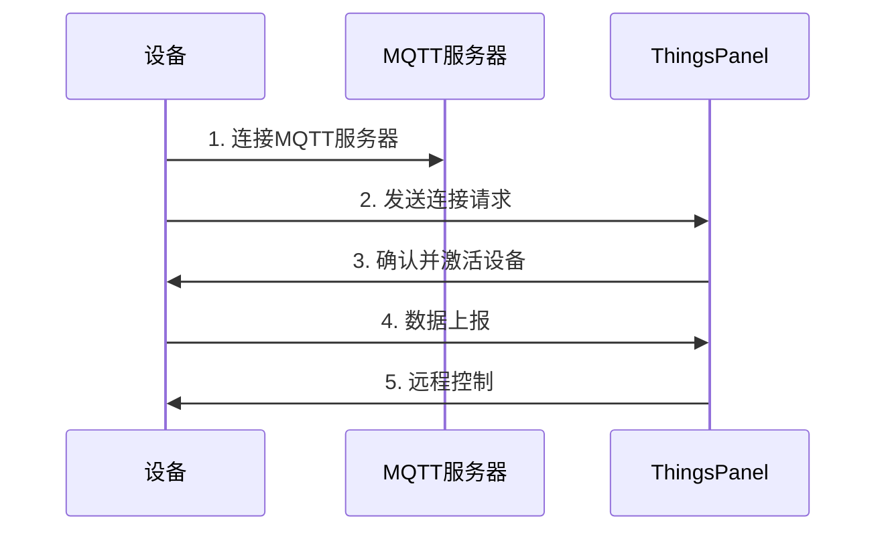

# 网关设备MQTT数据交互规范

## 概述

本规范描述通过MQTT协议连接到ThingsPanel的网关设备接入要求，定义了设备与平台之间的数据交互格式和流程。

:::info 重要说明
- **message_id** 为消息标识符，近期消息不重复即可，可取毫秒时间戳的后七位（仅为建议，实际不限制长度）
- **device_number** 为设备编号，设备唯一标识，平台可修改
- **sub_device_address** 为子设备地址，网关下唯一，平台可修改
- 核心交互数据分为四类：**遥测、属性、事件、命令**
:::

:::note 灵活性说明
- **订阅和发布** - 设备对于主题的订阅和发布都是可选的，可根据实际需求选择
- **响应机制** - 设备响应也是可选的，可根据业务场景决定是否实现
- **报文格式** - 非规范的报文也支持，可通过平台脚本转换为规范格式
:::

## 设备要求

设备需具备以下特性：

- ✅ MQTT客户端能力
- ✅ 可联网并稳定运行

## 接入步骤



1. **注册设备** - 在ThingsPanel创建设备并获取配置
2. **建立连接** - 设备连接到MQTT服务器
3. **发送请求** - 设备发送连接请求消息
4. **激活确认** - ThingsPanel确认并激活设备
5. **数据交互** - 设备上报数据，接收平台控制

## MQTT主题规范

### 设备上报主题（平台订阅）

| 主题 | 说明 | 数据类型 | 是否必需 |
|------|------|----------|----------|
| `gateway/telemetry` | 上报遥测数据 | 遥测 | 可选 |
| `gateway/attributes/{message_id}` | 上报属性状态 | 属性 | 可选 |
| `gateway/event/{message_id}` | 上报事件信息 | 事件 | 可选 |
| `gateway/command/response/{message_id}` | 命令执行响应 | 响应 | 可选 |
| `gateway/attributes/set/response/{message_id}` | 属性设置响应 | 响应 | 可选 |

### 设备订阅主题（平台下发）

:::note 主题说明
**注意：** `+` 表示 `message_id` 占位符，长度不限制
:::

| 主题 | 说明 | 数据类型 | 是否必需 |
|------|------|----------|----------|
| `gateway/telemetry/control/{device_number}` | 接收遥测控制指令 | 控制 | 可选 |
| `gateway/attributes/set/{device_number}/+` | 接收属性设置指令 | 属性设置 | 可选 |
| `gateway/attributes/get/{device_number}` | 接收属性查询请求 | 属性查询 | 可选 |
| `gateway/command/{device_number}/+` | 接收命令执行请求 | 命令 | 可选 |
| `gateway/attributes/response/{device_number}/+` | 接收属性响应确认 | 响应确认 | 可选 |
| `gateway/event/response/{device_number}/+` | 接收事件响应确认 | 响应确认 | 可选 |

## 数据交互格式

### 1. 遥测数据上报

**主题：** `gateway/telemetry`

#### 实时上报模式

直接键值对格式，系统自动使用服务器接收时间作为时间戳。

```json title="实时遥测数据格式示例（单层网关）"
{
    "gateway_data": {
        "temperature": 25.5,
        "version": "1.0.0",
        "switch": true
    },
    "sub_device_data": {
        "sensor_001": {
            "temperature": 24.0,
            "humidity": 65.0,
            "switch": true
        },
        "sensor_002": {
            "temperature": 26.5,
            "humidity": 60.0,
            "switch": false
        }
    }
}
```

```json title="实时遥测数据格式示例（多级网关）"
{
  "gateway_data": { 
    "temperature": 26.0, 
    "version": "2.0.0", 
    "switch": true 
  },
  "sub_device_data": {
    "device_001": { 
      "temperature": 25.0, 
      "humidity": 70.0 
    }
  },
  "sub_gateway_data": {
    "gateway_001": {
      "gateway_data": { 
        "temperature": 28.0, 
        "version": "1.5.0", 
        "switch": true 
      },
      "sub_device_data": {
        "sensor_101": { 
          "temperature": 27.5, 
          "humidity": 55.0 
        }
      }
    }
  }
}
```

#### 历史上报模式

时间序列数组格式，每条记录包含时间戳和对应的数据值。

```json title="历史遥测数据格式示例（单层网关）"
{   
    "gateway_data": [
        {"ts": 1754928146491, "values": {"temperature": 25.0, "humidity": 60.0}},
        {"ts": 1754931746491, "values": {"temperature": 26.0, "humidity": 62.0}}
    ],
    "sub_device_data": {
        "sensor_001": [
            {"ts": 1754928146491, "values": {"temperature": 24.5, "humidity": 65.0}},
            {"ts": 1754931746491, "values": {"temperature": 25.5, "humidity": 63.0}}
        ]
    }
}
```

```json title="历史遥测数据格式示例（多级网关）"
{
  "gateway_data": [
    {"ts": 1754928146491, "values": {"temperature": 26.0, "humidity": 70.0}},
    {"ts": 1754931746491, "values": {"temperature": 27.0, "humidity": 68.0}}
  ],
  "sub_device_data": {
    "device_001": [
      {"ts": 1754928146491, "values": {"temperature": 25.0, "humidity": 72.0}}
    ]
  },
  "sub_gateway_data": {
    "gateway_001": {
      "gateway_data": [
        {"ts": 1754928146491, "values": {"temperature": 28.0, "humidity": 55.0}}
      ],
      "sub_device_data": {
        "sensor_101": [
          {"ts": 1754931746491, "values": {"temperature": 29.0, "humidity": 52.0}}
        ]
      }
    }
  }
}
```

### 2. 属性数据上报

**主题：** `gateway/attributes/{message_id}`

#### 单层网关属性上报

```json title="属性数据格式示例（单层网关）"
{
    "gateway_data": {
        "ip": "192.168.1.100",
        "version": "1.0.0",
        "mac": "00:11:22:33:44:55"
    },
    "sub_device_data": {
        "sensor_001": {
            "ip": "192.168.1.101",
            "version": "1.2.0",
            "type": "temperature"
        },
        "sensor_002": {
            "ip": "192.168.1.102",
            "version": "1.1.0",
            "type": "humidity"
        }
    }
}
```

#### 多级网关属性上报

```json title="属性数据格式示例（多级网关）"
{
  "gateway_data": { 
    "ip": "192.168.1.100", 
    "version": "2.0.0",
    "mac": "00:11:22:33:44:55"
  },
  "sub_device_data": {
    "device_001": { 
      "ip": "192.168.1.101", 
      "version": "1.5.0",
      "type": "sensor"
    }
  },
  "sub_gateway_data": {
    "gateway_001": {
      "gateway_data": { 
        "ip": "192.168.1.200", 
        "version": "1.8.0",
        "mac": "00:AA:BB:CC:DD:EE"
      },
      "sub_device_data": {
        "sensor_101": { 
          "ip": "192.168.1.201", 
          "version": "1.3.0",
          "type": "actuator"
        }
      }
    }
  }
}
```

### 3. 事件数据上报

**主题：** `gateway/event/{message_id}`

#### 实时事件上报

```json title="实时事件数据格式示例（单层网关）"
{
    "gateway_data": {
        "method": "SystemStarted",
        "params": {
            "version": "1.0.0",
            "mode": "normal"
        }
    },
    "sub_device_data": {
        "sensor_001": {
            "method": "AlarmTriggered",
            "params": {
                "level": "high",
                "sensor": "temperature"
            }
        },
        "sensor_002": {
            "method": "StatusChanged",
            "params": {
                "status": "online",
                "timestamp": 1609459200
            }
        }
    }
}
```

```json title="实时事件数据格式示例（多级网关）"
{
    "gateway_data": {
        "method": "SystemStarted",
        "params": { 
          "version": "2.0.0", 
          "mode": "normal" 
        }
    },
    "sub_device_data": {
        "device_001": {
            "method": "AlarmTriggered",
            "params": { 
              "level": "medium", 
              "sensor": "humidity" 
            }
        }
    },
    "sub_gateway_data": {
        "gateway_001": {
            "gateway_data": {
                "method": "ConfigChanged",
                "params": { 
                  "setting": "interval", 
                  "value": 60 
                }
            },
            "sub_device_data": {
                "sensor_101": {
                    "method": "StatusChanged",
                    "params": { 
                      "status": "offline", 
                      "reason": "timeout" 
                    }
                }
            }
        }
    }
}
```

#### 历史事件上报

```json title="历史事件数据格式示例（多级网关）"
{
    "gateway_data": [
        {
            "ts": 1609459200000,
            "method": "SystemStarted",
            "params": {
                "version": "2.0.0",
                "mode": "normal"
            }
        },
        {
            "ts": 1609462800000,
            "method": "ConfigChanged",
            "params": {
                "setting": "report_interval",
                "value": 30
            }
        }
    ],
    "sub_gateway_data": {
        "gateway_001": {
            "gateway_data": [
                {
                    "ts": 1609459200000,
                    "method": "NetworkConnected",
                    "params": {
                        "ip": "192.168.1.200",
                        "signal": "strong"
                    }
                }
            ],
            "sub_device_data": {
                "sensor_101": [
                    {
                        "ts": 1609460800000,
                        "method": "AlarmTriggered",
                        "params": {
                            "level": "high",
                            "sensor": "temperature"
                        }
                    },
                    {
                        "ts": 1609464400000,
                        "method": "StatusChanged",
                        "params": {
                            "status": "offline",
                            "reason": "power_loss"
                        }
                    }
                ]
            }
        }
    }
}
```

### 4. 接收控制指令

**主题：** `gateway/telemetry/control/{device_number}`

```json title="控制指令格式示例（单层网关）"
{
    "gateway_data": {
        "temperature": 25.0,
        "brightness": 80,
        "switch": true
    },
    "sub_device_data": {
        "sensor_001": {
            "temperature": 26.0,
            "switch": false
        },
        "sensor_002": {
            "brightness": 60,
            "mode": "auto"
        }
    }
}
```

```json title="控制指令格式示例（多级网关）"
{
    "gateway_data": {
        "temperature": 25.0,
        "switch": true
    },
    "sub_device_data": {
        "device_001": {
            "brightness": 70,
            "switch": false
        }
    },
    "sub_gateway_data": {
        "gateway_001": {
            "gateway_data": {
                "temperature": 24.0,
                "mode": "eco"
            },
            "sub_device_data": {
                "sensor_101": {
                    "brightness": 50,
                    "switch": true
                }
            }
        }
    }
}
```

### 5. 接收属性设置

**主题：** `gateway/attributes/set/{device_number}/+`

```json title="属性设置格式示例（单层网关）"
{
    "gateway_data": {
        "ip": "192.168.1.100",
        "heartbeat": 30,
        "report_interval": 60
    },
    "sub_device_data": {
        "sensor_001": {
            "ip": "192.168.1.101",
            "sampling_rate": 10
        },
        "sensor_002": {
            "ip": "192.168.1.102",
            "threshold": 80
        }
    }
}
```

```json title="属性设置格式示例（多级网关）"
{
    "gateway_data": {
        "ip": "192.168.1.100",
        "heartbeat": 30,
        "encryption": true
    },
    "sub_device_data": {
        "device_001": {
            "ip": "192.168.1.101",
            "sampling_rate": 15
        }
    },
    "sub_gateway_data": {
        "gateway_001": {
            "gateway_data": {
                "ip": "192.168.1.200",
                "report_interval": 45
            },
            "sub_device_data": {
                "sensor_101": {
                    "ip": "192.168.1.201",
                    "threshold": 75
                }
            }
        }
    }
}
```

### 6. 接收属性查询请求

**主题：** `gateway/attributes/get/{device_number}`

**查询所有属性：**
```json title="查询所有属性"
{
    "gateway_data": []
}
```

**查询指定属性（单层网关）：**
```json title="查询指定属性（单层网关）"
{
    "gateway_data": ["ip", "version"],
    "sub_device_data": {
        "sensor_001": ["temperature", "humidity"],
        "sensor_002": ["brightness", "status"]
    }
}
```

**查询指定属性（多级网关）：**
```json title="查询指定属性（多级网关）"
{
    "gateway_data": ["version", "mac"],
    "sub_device_data": {
        "device_001": ["temperature", "humidity"]
    },
    "sub_gateway_data": {
        "gateway_001": {
            "gateway_data": ["ip", "version"],
            "sub_device_data": {
                "sensor_101": ["brightness", "status"]
            }
        }
    }
}
```

### 7. 接收命令执行请求

**主题：** `gateway/command/{device_number}/+`

```json title="命令执行格式示例（单层网关）"
{
    "gateway_data": {
        "method": "Restart",
        "params": {
            "delay": 5,
            "mode": "safe"
        }
    },
    "sub_device_data": {
        "sensor_001": {
            "method": "Calibrate",
            "params": {
                "sensor": "temperature",
                "offset": 0.5
            }
        },
        "sensor_002": {
            "method": "SetThreshold",
            "params": {
                "type": "humidity",
                "value": 80
            }
        }
    }
}
```

```json title="命令执行格式示例（多级网关）"
{
    "gateway_data": {
        "method": "UpdateConfig",
        "params": {
            "setting": "report_interval",
            "value": 30
        }
    },
    "sub_device_data": {
        "device_001": {
            "method": "Reset",
            "params": {
                "type": "factory",
                "preserve_network": true
            }
        }
    },
    "sub_gateway_data": {
        "gateway_001": {
            "gateway_data": {
                "method": "SyncTime",
                "params": {
                    "timezone": "UTC+8",
                    "ntp_server": "pool.ntp.org"
                }
            },
            "sub_device_data": {
                "sensor_101": {
                    "method": "Calibrate",
                    "params": {
                        "sensor": "pressure",
                        "reference": 1013.25
                    }
                }
            }
        }
    }
}
```

## 响应格式规范

### 响应参数说明

| 参数 | 是否必输 | 类型 | 说明 |
|------|----------|------|------|
| `result` | ✅ | number | 执行结果：`0`-成功，`1`-失败 |
| `errcode` | ❌ | string | 错误码（失败时提供） |
| `message` | ✅ | string | 响应消息内容 |
| `ts` | ❌ | number | 时间戳（秒） |
| `method` | ❌ | string | 事件和命令的方法名 |

### 响应格式示例

**成功响应：**
```json title="操作成功"
{
  "result": 0,
  "message": "success",
  "ts": 1609459200
}
```

**失败响应：**
```json title="操作失败"
{
  "result": 1,
  "errcode": "INVALID_PARAM",
  "message": "Invalid parameter value",
  "ts": 1609459200,
  "method": "UpdateConfig"
}
```

**带方法的成功响应：**
```json title="命令执行成功"
{
  "result": 0,
  "message": "Command executed successfully",
  "ts": 1609459200,
  "method": "UpdateConfig"
}
```

## 格式识别规则

### 遥测数据格式识别
- **实时模式**：`gateway_data`、`sub_device_data` 或 `sub_gateway_data` 的值为键值对对象
- **历史模式**：`gateway_data`、`sub_device_data` 或 `sub_gateway_data` 的值为数组，数组元素包含 `ts` 和 `values` 字段

### 事件数据格式识别
- **实时模式**：`gateway_data`、`sub_device_data` 或 `sub_gateway_data` 的值包含 `method` 字段且不包含 `ts` 字段
- **历史模式**：`gateway_data`、`sub_device_data` 或 `sub_gateway_data` 的值为数组，数组元素同时包含 `ts` 和 `method` 字段

### 字段说明

| 字段 | 类型 | 说明 |
|------|------|------|
| `ts` | number | Unix时间戳（毫秒级） |
| `values` | object | 该时间点的遥测数据键值对 |
| `method` | string | 事件方法名，必填字段 |
| `params` | object | 事件参数，可选字段 |

## 多级网关架构

### 层级结构说明

- **`gateway_data`**：当前网关自身的数据
- **`sub_device_data`**：直接挂载的普通子设备数据
- **`sub_gateway_data`**：子网关及其下属设备数据（可递归多层）

### 架构说明

- MQTT主题路径保持不变，支持单层和多级网关架构
- 设备可根据实际需求选择使用单层或多级网关模式
- 多级网关支持无限层级嵌套，适应复杂网络拓扑

## 脚本转换支持

:::tip 自定义格式支持
平台支持非规范格式的报文，可以通过以下方式处理：

1. **脚本转换** - 在平台配置脚本，将自定义格式转换为规范格式
2. **灵活接入** - 设备可以使用现有的数据格式，无需强制修改
3. **数据映射** - 通过脚本实现字段映射和数据转换
4. **兼容性** - 保持设备原有协议的同时，满足平台数据规范要求
:::

## 最佳实践

:::tip 开发建议
1. **消息ID管理** - 建议使用时间戳后7位，但长度不限制，确保消息ID在近期不重复即可
2. **可选实现** - 根据实际业务需求选择订阅、发布和响应的实现
3. **数据验证** - 上报前验证JSON格式的正确性
4. **连接保持** - 实现MQTT心跳机制保持连接稳定
5. **重连机制** - 网络异常时自动重连
6. **脚本利用** - 对于现有设备，可利用平台脚本功能实现格式转换
:::

:::warning 注意事项
- 确保设备编号在系统中唯一
- 遥测数据建议定期上报，避免数据丢失
- 如实现响应机制，命令执行后建议返回响应确认
- 属性设置时建议验证参数有效性
- 非规范报文虽然支持，但建议优先使用规范格式以获得更好的性能
:::
