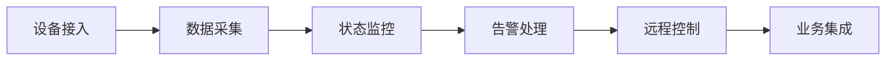

# 应用场景

ThingsPanel 适合需要连接设备、采集数据、远程控制和业务集成的物联网项目。

它不是只服务某一个行业。
它更像一层通用的物联网平台能力。

先把设备接进来。
再把数据管起来。
然后做监控、告警、控制和业务联动。

## 一句话理解

ThingsPanel 帮助团队快速搭建物联网平台。

它面向四类典型用户：

- **设备厂商**：让设备更快上云。
- **企业客户**：统一管理现场设备。
- **系统集成商**：更快交付行业项目。
- **开发者**：基于开放接口构建应用。

## 适合谁使用

### 面向设备厂商

设备厂商通常关注三件事：

- 设备能不能稳定接入。
- 数据能不能清楚展示。
- 项目能不能快速交付。

ThingsPanel 可以提供从设备接入、物模型配置、数据采集到远程控制的一体化能力。

厂商不必从零开发后台。
也不必为每个客户重复搭建基础系统。

适合用于：

- 设备研发联调。
- 出厂前接入验证。
- 客户演示平台。
- 设备上云解决方案。
- OEM 项目交付。

### 面向企业

企业通常已经有很多设备。

这些设备可能来自不同厂商。
使用不同协议。
分布在不同现场。

ThingsPanel 可以把这些设备统一接入。
再统一监控、告警和管理。

企业可以用它建设自己的物联网基础平台。
也可以把设备数据提供给业务系统、数据中台和可视化大屏。

适合用于：

- 设备集中监控。
- 运行状态管理。
- 异常告警处理。
- 远程控制。
- 业务系统对接。

### 面向系统集成商

系统集成商需要快速落地项目。

项目现场往往设备多。
协议杂。
需求变化快。

ThingsPanel 可以把通用能力提前准备好。
集成商可以把主要精力放在行业方案和客户业务上。

适合用于：

- 智慧园区。
- 智慧楼宇。
- 能源监测。
- 工业设备监控。
- 农业和环境监测。
- 应急和安防项目。

### 面向开发者

开发者需要清晰的接入方式。
也需要稳定的接口。

ThingsPanel 提供设备接入、数据管理、规则处理、可视化和开放 API。

开发者可以基于这些能力继续构建应用。
例如业务系统、运维工具、移动端应用和数据分析服务。

适合用于：

- 协议接入开发。
- 业务系统集成。
- 数据看板开发。
- 自动化规则扩展。
- 二次开发和插件扩展。

## 典型行业场景

ThingsPanel 的行业覆盖面很广。

不同场景看起来不同。
底层诉求却很接近。

都是把设备接进来。
把数据采上来。
把状态看清楚。
把异常处理掉。

常见场景包括：

| 场景 | 典型设备 | 核心用途 |
| --- | --- | --- |
| 能源与电力 | 电表、配电柜、储能设备、光伏设备 | 采集运行数据，监测能耗与异常 |
| 工业与矿山 | 生产设备、传感器、网关、控制器 | 接入现场设备，集中监控运行状态 |
| 交通与园区 | 停车设备、照明设备、环境传感器、安防设备 | 管理分散设备，支持联动控制 |
| 楼宇与社区 | 空调、门禁、水电表、环境传感器 | 统一管理设备，展示运行数据 |
| 农业与气象 | 土壤传感器、灌溉设备、气象站 | 采集环境数据，触发控制策略 |
| 应急与环保 | 烟感、气感、水质监测、预警设备 | 实时监控风险，及时上报告警 |

## 典型使用过程

一个物联网项目通常会经历下面几个步骤。

### 第一步：接入设备

先把设备接入平台。

可以是传感器。
可以是控制器。
也可以是网关和第三方系统。

### 第二步：采集数据

设备开始上报数据。

平台负责接收、解析、存储和展示。

### 第三步：看见状态

用户可以查看设备在线状态。
也可以查看实时数据、历史曲线和运行趋势。

### 第四步：处理异常

当数据超过阈值，或设备出现异常时，平台可以触发告警。

告警可以用于提醒人员。
也可以驱动自动化规则。

### 第五步：控制设备

用户可以通过平台下发控制命令。

例如开关设备、调整参数、重启网关或执行现场动作。

### 第六步：连接业务

最后，把设备数据交给上层业务系统。

例如：

- 数据中台。
- 可视化大屏。
- 运维系统。
- 告警系统。
- 企业内部业务系统。

## 部署方式

ThingsPanel 支持私有化部署。
也支持云端部署。

### 私有化部署

适合对数据安全、网络边界和系统控制权要求较高的项目。

例如内网项目、专有云项目、政企项目和需要深度定制的场景。

### 云端部署

适合希望快速上线、统一运维和弹性扩容的项目。

可以部署在阿里云、华为云或其他主流云基础设施上。

## 核心价值

ThingsPanel 的价值可以概括为五点：

- **接得快**：支持多类设备和多种接入方式。
- **看得清**：统一展示设备状态、数据和告警。
- **控得住**：支持远程控制和自动化联动。
- **交付快**：通过模板、规则和可视化能力提高复用效率。
- **好集成**：通过开放 API 连接业务系统和数据平台。

## 适用边界

如果项目中有设备。
有数据。
有监控。
有控制。
有系统集成需求。

ThingsPanel 就可以作为物联网平台底座，可以逐步扩展到多项目、多现场、多系统的统一管理。
