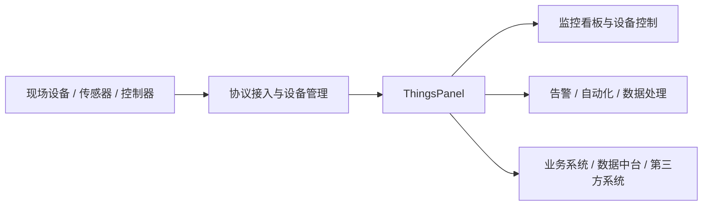

# 应用场景

ThingsPanel 是面向物联网设备接入、数据采集、设备控制与业务集成的通用平台，可用于从单项目交付到企业级平台建设的多种场景。

本文从行业场景、使用角色与部署方式三个维度，帮助您快速理解 ThingsPanel 的适用范围。

## 行业应用场景

ThingsPanel 可支持各类以“设备接入 + 数据采集 + 状态监控 + 远程控制”为核心诉求的项目场景，常见包括：

- **能源与电力**：用于电表、配电柜、储能设备、光伏设备等的运行监测、数据采集与告警管理。
- **工业与矿山**：用于生产设备、传感器、网关及现场控制设备的统一接入与集中监控。
- **交通与园区**：用于停车、照明、环境监测、安防设备等系统的联网与联动管理。
- **楼宇与社区**：用于空调、门禁、水电表、环境传感器等设备的统一管理与可视化展示。
- **农业与气象**：用于农业传感器、灌溉设备、气象站等设备的数据采集、规则处理与远程控制。
- **应急与环保**：用于烟感、气感、水质监测、灾害预警等场景中的实时监控与事件上报。

这些场景虽然行业不同，但通常都具有相似的平台诉求：设备协议多样、数据结构复杂、管理规模较大，并且需要统一接入、统一展示、统一告警和统一运维。

## 适用的业务角色

ThingsPanel 不仅适用于最终用户建设自有物联网平台，也适用于生态伙伴在项目交付、设备研发与集成实施中的多种角色。

### 设备研发与调试

设备厂商或研发团队可以将 ThingsPanel 作为设备研发、联调与验证阶段的管理后台，用于：

- 验证设备通信协议与数据上报是否正常。
- 调试设备属性、命令、事件等物模型能力。
- 快速搭建测试用看板、图表与控制界面。
- 在设备量产前完成接入流程验证与模板沉淀。

### 项目交付与行业集成

软件外包公司、系统集成商或行业解决方案提供商，可以基于 ThingsPanel 快速交付物联网项目，用于：

- 统一管理不同厂商、不同协议的设备接入。
- 构建行业项目所需的设备管理、监控和告警能力。
- 通过设备模板、规则与自动化能力复用项目配置。
- 缩短从方案设计到系统上线的实施周期。

### 作为物联网中台

在企业数字化架构中，ThingsPanel 也可以作为物联网中台，为上层业务系统或数据中台提供统一的设备数据入口。

例如，企业可以通过 ThingsPanel 汇聚来自现场设备、边缘网关和第三方系统的数据，再将标准化后的设备数据输出给：

- 业务系统
- 数据中台
- 可视化大屏
- 运维系统
- 告警与自动化系统

下面的结构图展示了 ThingsPanel 在典型业务架构中的位置：

## 部署方式

ThingsPanel 支持多种部署方式，可根据项目阶段、数据安全要求与运维能力灵活选择。

### 私有化部署

对于有数据隔离、内网运行或定制化要求的项目，可采用私有化部署方式。该方式适合对数据安全、网络边界或系统可控性要求较高的客户场景。

### 云端部署

对于希望快速上线、统一运维或弹性扩容的项目，可采用云端部署方式。ThingsPanel 可运行在常见云平台环境中，例如阿里云、华为云以及其他主流云基础设施。

## 适用价值总结

综合来看，ThingsPanel 的价值主要体现在以下几个方面：

- **统一接入**：适配多种设备协议与设备类型，降低异构设备接入成本。
- **快速交付**：通过物模型、设备模板和规则配置提升项目复用效率。
- **集中管理**：统一完成设备监控、告警处理、远程控制和数据展示。
- **灵活部署**：同时支持私有化部署与云端部署，适配不同项目要求。
- **便于集成**：可作为物联网中台，为上层业务系统持续提供标准化设备数据。
