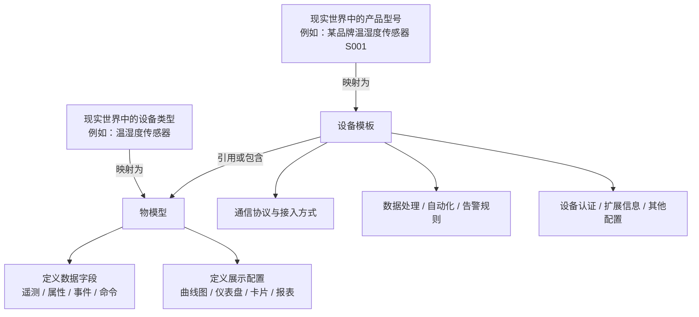

# 相关概念

## 系统结构相关

### 物模型

物模型是对某一类设备在平台中的数据结构与交互能力的标准化抽象，用于描述这类设备“能上报什么、具备什么状态、会触发什么事件、可执行什么命令”。

可以将其理解为同类设备的“标准画像”或可复用的软件标准件。例如，不同厂商、不同型号的温湿度传感器虽然硬件实现各不相同，但在平台侧通常都围绕温度、湿度等核心数据进行采集、展示和交互，因此可以抽象为同一类物模型。

**物模型的核心作用包括：**

- 统一定义设备的数据字段，例如遥测、属性、事件、命令。
- 约束字段的名称、类型、单位、读写方式及业务含义。
- 定义这些数据在平台中的展示方式，例如曲线图、仪表盘、卡片或报表。
- 为同类设备提供一致的数据语义，降低接入、展示和运维成本。

**在现实世界中，物模型更接近“设备类型”**，例如：温湿度传感器、烟雾报警器、电表。

### 设备模板

设备模板是在物模型基础上，对某一类具体设备接入与管理方案的进一步封装。它面向的是平台中的可落地配置，而不仅仅是抽象的数据定义。

可以将其理解为某款设备在软件层面的“总配置单”或“全家桶”。它通常不仅包含物模型，还会关联设备接入所需的协议、数据处理规则以及设备管理所需的其他配置。

**设备模板的核心作用包括：**

- 复用并绑定一个适用的物模型。
- 约定设备采用的通信协议与接入方式。
- 预置数据预处理、自动化联动、告警规则等运行配置。
- 承载设备认证、扩展信息及其他与具体接入方案相关的设置。
- 在创建设备时提供一键复用能力，减少重复配置工作。

**在现实世界中，设备模板更接近“产品型号”**，例如：某品牌温湿度传感器 `S001`。

### 物模型与设备模板的关系

物模型与设备模板紧密相关，但两者关注点不同：

- **物模型**关注的是这类设备的通用能力定义，即“这类设备有哪些数据、状态、事件和控制能力”。
- **设备模板**关注的是具体设备在平台中的落地方案，即“这款设备应如何接入、如何处理数据、如何被管理”。

可以理解为：**物模型定义共性，设备模板封装落地配置；设备模板通常会引用或包含一个物模型，但其范围大于物模型。**

下面的结构图展示了两者在现实世界映射关系与平台配置层面的区别：

### 简单总结

- **物模型**解决的是“这类设备具备哪些通用数据与控制能力”的标准化定义问题。
- **设备模板**解决的是“这款具体设备如何在平台中完成接入与运行”的工程化配置问题。
- 在实际使用中，通过设备模板可以将物模型与协议、规则、认证及扩展配置打包复用，从而实现设备的快速接入与批量管理。

## 设备接入方式相关

ThingsPanel的设备接入服务和三方设备接入服务是其实现设备接入的重要工具，以下是简单描述：

### 设备接入服务
- **功能**：主要解决各类协议接入的问题，让ThingsPanel能够与支持不同通信协议的设备进行连接和数据交互.
- **举例**：比如MQTT设备接入服务，能使ThingsPanel与使用MQTT协议的设备顺利通信，接收设备发送的数据，并可向设备发送指令等；Modbus设备接入服务则可让平台接入遵循Modbus协议的工业设备，实现对这些设备数据的采集和控制.
- **作用**：通过设备接入服务，ThingsPanel可以兼容多种设备协议，打破了设备之间的通信壁垒，将各种不同类型、不同协议的设备统一接入到平台中，实现设备的集中管理和数据的汇聚.

### 三方设备接入服务
- **功能**：是通过第三方平台接入设备的一种方式，可将第三方平台上的设备数据整合到ThingsPanel中.
- **举例**：例如ThingsPanel的中移动OneNet三方设备接入服务，安装配置该设备接入服务后，就能把OneNet平台上的设备数据同步到ThingsPanel平台，实现在ThingsPanel上对OneNet设备的统一管理和监控.
- **作用**：三方设备接入服务拓展了ThingsPanel的设备接入范围，使其能够与更多第三方系统集成，避免了数据孤岛，实现了不同平台设备数据的融合和共享，为用户提供了更全面、更便捷的设备管理体验.
 

## 设备数据定义相关

| 概念 | 描述 | 示例 |
|------|------|------|
| 遥测（Telemetry） | 遥测数据是设备自动收集和发送的数据，通常用于监控设备的运行状态或环境条件。这些数据通常是只读的，并且频繁地发送。 | 温度传感器定期发送当前温度数据。 |
| 属性（Property） | 属性代表设备的配置或状态，可以是只读的，也可以是可写的。用户或系统可以修改可写的属性，以改变设备的配置或行为。 | 空调的目标温度可以设置为22度，用户可以通过手机应用更改此设置。 |
| 命令（Command） | 命令是向设备发送的指令，用于执行特定操作。这通常是一个单向的交互，从服务器到设备。 | 向打印机发送打印命令以开始打印文档。 |
| 事件（Event） | 事件是设备在特定条件下产生的信号，通常用于通知系统某些特定的变化或异常。 | 烟雾报警器在检测到烟雾时发送警报事件。 |
