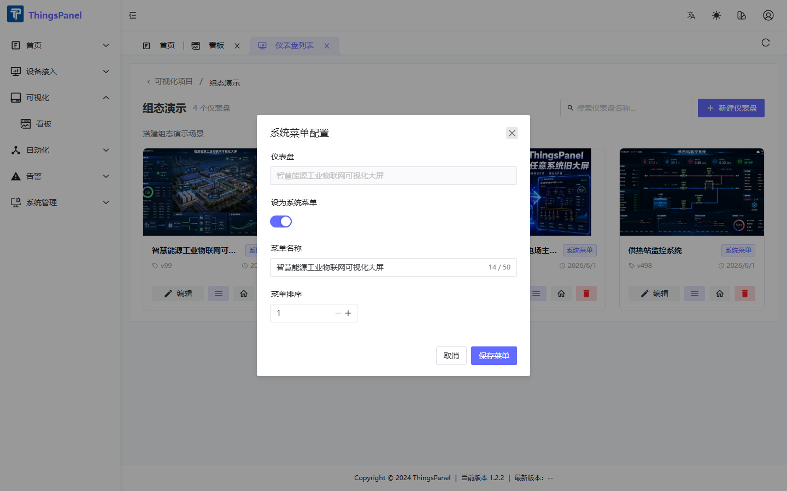

# 进阶配置

## 系统菜单配置弹窗

将仪表盘挂到 ThingsPanel 侧边栏，方便运营人员从菜单直达。

### 如何打开

1. 进入 **可视化 → 看板**，打开目标项目的仪表盘列表。
2. 在目标仪表盘卡片底部点击 **菜单图标**（三条横线）。
3. 弹出 **系统菜单配置** 对话框。



### 弹窗配置项

| 配置项 | 说明 |
|--------|------|
| **仪表盘** | 只读，显示当前要挂载的仪表盘名称 |
| **设为系统菜单** | 开关，打开后该看板出现在侧边栏菜单 |
| **菜单名称** | 侧边栏显示的文字，最多 50 字 |
| **菜单排序** | 数字越小越靠前，可用 `-` / `+` 调整 |
| **取消** | 关闭弹窗，不保存 |
| **保存菜单** | 保存配置并刷新侧边栏 |

保存后侧边栏自动刷新，出现新菜单项，以预览模式展示该看板。

:::info 首次加入菜单
第一次将某仪表盘加入菜单时，系统会自动把当前首页仪表盘也追加到菜单中，避免首页变成带子菜单的展开项。
:::

取消挂载：在同一弹窗关闭「启用菜单」后保存。

## 设为首页

详见 [项目与仪表盘](./thingsvis-project.md#设为首页)。

设为首页后，用户登录访问 `/home` 将全屏展示该看板。

## 全屏预览与分享

| 方式 | 地址 / 操作 | 是否需登录 |
|------|-------------|------------|
| 列表预览 | 点击缩略图 → `/tv-preview?id=xxx` | 否 |
| 编辑器预览 | 顶部「预览」按钮 | 是 |
| 分享链接 | 顶部「分享」→ 创建链接 | 否（含 shareToken） |

分享前须先 **保存** 仪表盘。

## 超管独立看板空间

`SYS_ADMIN`（系统超管）使用独立的 ThingsVis 空间 `thingspanel-sys-admin`，与普通租户数据隔离。

### 角色与空间

| ThingsPanel 角色 | ThingsVis 角色 | 数据范围 |
|------------------|----------------|----------|
| `SYS_ADMIN` | `SUPER_ADMIN` | 全平台统计 |
| `TENANT_ADMIN` | `TENANT_ADMIN` | 本租户 |
| 普通用户 | `EDITOR` | 本租户 |

### 超管首次使用

超管首次登录时，系统自动创建：

- 项目：`Super Admin Project`
- 首页看板：`Super Admin Home`（已绑定系统统计组件）

若首页尚未配置，登录后显示引导页，点击 **「前往可视化项目」** 进入 `/visualization/thingsvis` 进行配置。

### 注意事项

1. 超管在「看板」中看到的是 **超管空间** 的项目，不是某个租户的项目。
2. 设为首页仅影响 **超管自己的首页**。
3. 为租户配置看板须使用 **该租户管理员账号** 登录操作。
4. 系统数据字段（`device_total` 等）在超管空间统计 **全平台** 数据。

## 组件开发简介

### 使用内置组件

在编辑器左侧组件库拖拽使用，覆盖指标、图表、工业、媒体等分类。详见 [编辑器操作](./thingsvis-editor.md) 与 [组件说明](./thingsvis-widgets.md)。

### 物模型图表预设

在 **设备接入 → 物模型 → Web 图表配置** 中，可为物模型设计组件预设模板，供同物模型设备复用。

### 自定义 Widget 开发

需 ThingsVis 开发环境，流程如下：

```bash
pnpm install
pnpm build:widgets
pnpm vis-cli create <分类> <组件名>   # 例：pnpm vis-cli create chart my-chart
```

核心文件：

| 文件 | 职责 |
|------|------|
| `schema.ts` | 属性结构和默认值 |
| `controls.ts` | 右侧属性面板 |
| `index.ts` | 渲染逻辑 |

构建后随 ThingsVis Studio 部署更新，新组件即出现在编辑器组件库中。详细开发文档见 [ThingsVis 官方文档](https://thingsvis.io)。
