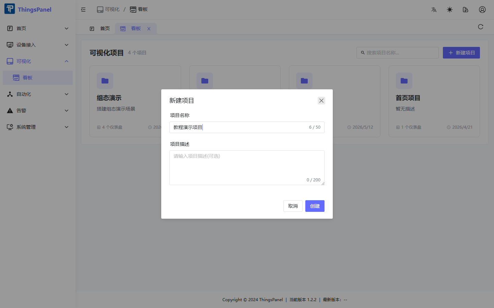
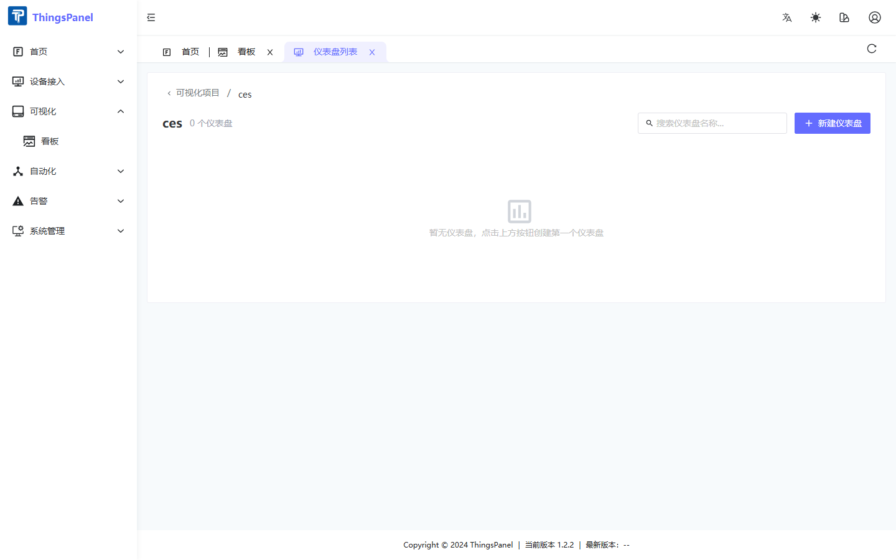
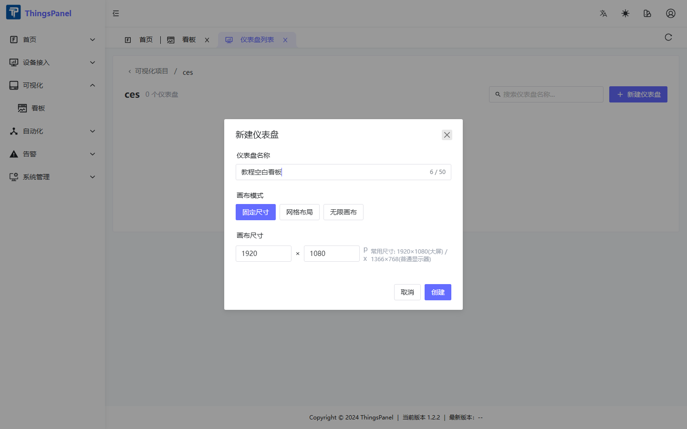

# 项目与仪表盘

## 新建项目

1. 进入 **可视化 → 看板**。
2. 点击右上角 **「新建项目」**。
3. 填写项目名称（必填）和描述（可选）。
4. 点击 **「创建」**。

创建成功后，项目卡片会出现在列表中，显示项目名称、描述、仪表盘数量和更新时间。

## 进入项目

点击项目卡片（避开编辑/删除按钮区域），进入该项目的仪表盘列表。

面包屑显示 `可视化项目 / <项目名称>`。空项目会提示「暂无仪表盘，点击上方按钮创建第一个仪表盘」。

## 新建仪表盘

1. 在项目内点击 **「新建仪表盘」**。
2. 填写仪表盘名称。
3. 选择画布模式：

| 模式 | 说明 | 推荐场景 |
|------|------|----------|
| 固定尺寸 | 指定宽高（默认 1920×1080） | 投屏大屏 |
| 网格布局 | 响应式栅格 | 运营看板 |
| 无限画布 | 自由延展 | 复杂组态 |

4. 点击 **「创建」**。

## 仪表盘操作

每个仪表盘卡片提供以下操作：

| 操作 | 说明 |
|------|------|
| 点击缩略图 | 新窗口全屏预览（`/tv-preview`） |
| 编辑 | 进入 ThingsVis 编辑器 |
| 菜单图标 | 配置系统侧边栏菜单 |
| 首页图标 | 设为登录后默认首页 |
| 删除 | 删除仪表盘（同步清理菜单配置） |

### 设为首页

点击房子图标 → 确认。设为首页后卡片右上角显示红色 **「首」** 标记。同一租户同时只有一个首页仪表盘。

### 删除规则

- 删除项目前须先删除其下所有仪表盘。
- 删除仪表盘会同步清理关联的系统菜单配置。
