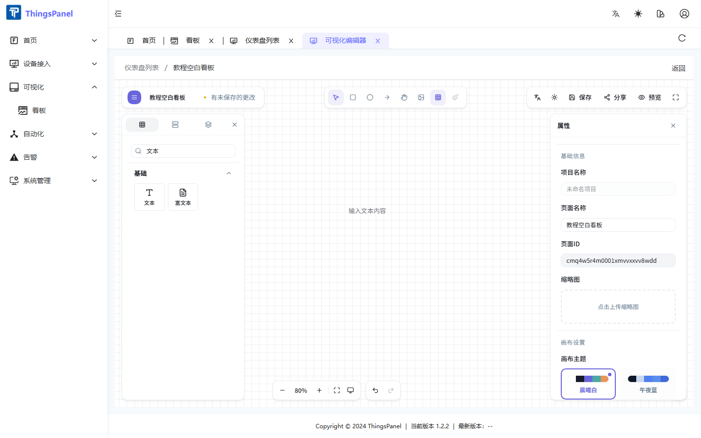
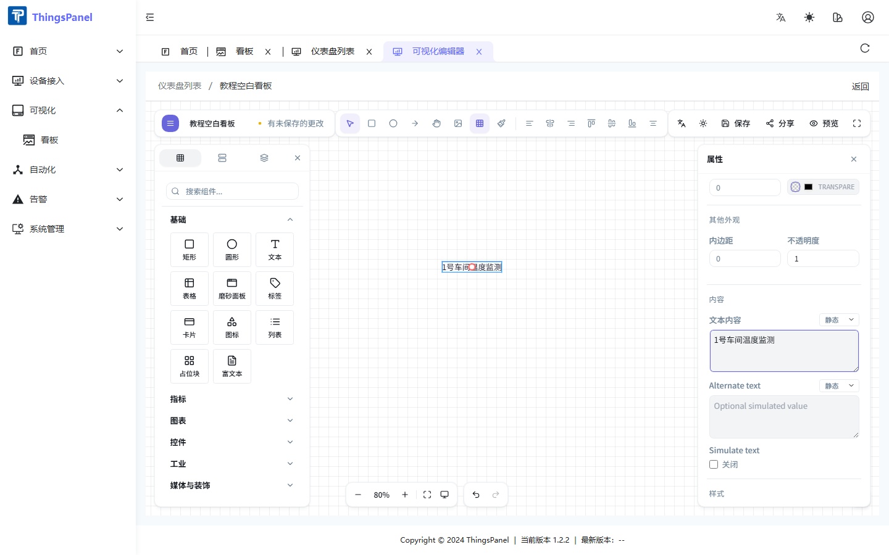

# 文本

← [返回组件说明](./thingsvis-widgets)

## 组件概述

**文本** 是 ThingsVis 基础类文字组件，用于在看板上展示单行或多行文字。支持静态文案、字段绑定和表达式，适合看板标题、区域标签、设备状态文字等场景。

| 项 | 值 |
|----|-----|
| 组件库路径 | 基础 → 文本 |
| 典型场景 | 标题、说明、动态状态文字 |

## 添加组件

1. 进入仪表盘 **编辑** 界面。
2. 在左侧组件库 **基础** 分类找到 **文本**，或搜索「文本」。
3. 将组件 **拖拽** 到画布上松开。



## 属性面板

选中画布上的文本组件，右侧 **属性** 面板显示以下配置项。通用外观项（背景、内边距、不透明度等）与其他组件一致，此处仅列出文本特有配置。



### 内容

| 配置项 | 说明 |
|--------|------|
| **文本内容** | 画布显示的文字，支持换行；旁侧下拉可切换 **静态 / 字段 / 表达式** |
| **Alternate text** | 备用文本，同样支持三种绑定模式 |
| **Simulate text** | 开启后按设定间隔轮换显示内容，用于演示效果 |
| **Simulate interval (ms)** | 模拟轮换间隔，500–60000 ms，仅 Simulate text 开启时显示 |

静态示例：保持 **文本内容** 为「静态」，输入 `1号车间温度监测`。

### 字体

| 配置项 | 说明 |
|--------|------|
| 字号 | 8–200 px |
| 字体 | Inter、Noto Sans SC、Noto Sans、无衬线 / 衬线 / 等宽 |
| 字重 | 正常、粗体、细体，或 100–900 |
| 字形 | 正常 / 斜体 |

### 排版

| 配置项 | 说明 |
|--------|------|
| 水平对齐 | 左 / 中 / 右 / 两端 |
| 垂直对齐 | 上 / 中 / 下 |
| 行高 | 0.5–5 |
| 字间距 | -10–50 |
| 装饰线 | 无 / 下划线 / 删除线 |

### 样式

| 配置项 | 说明 |
|--------|------|
| 文字颜色 | 文本填充色 |
| 阴影 | 可启用，配置颜色、模糊、X/Y 偏移 |

:::note
文本组件根据内容自适应尺寸（`resizable: false`），拖拽边角调整的是显示区域。
:::

## 数据配置

文本组件通过 **文本内容** 字段接入数据，操作步骤如下：

1. 选中文本组件。
2. 将 **文本内容** 切换为 **字段**。
3. 在 [字段选择器（数据绑定弹窗）](./thingsvis-data.md#字段选择器数据绑定弹窗) 中选择数据范围与字段。
4. 可选配置 **数据变换** 格式化显示。

### 示例：设备在线状态

```
文本内容：[字段] device_online
数据变换：value ? '在线' : '离线'
字号：18
```

### 示例：看板标题（静态）

```
文本内容：智慧能源监控大屏
字号：32
字重：粗体
水平对齐：中
```

## 画布操作

| 操作 | 方式 |
|------|------|
| 移动 | 拖拽组件 |
| 删除 | 选中后 Delete |
| 复制 | Ctrl+C / Ctrl+V |
| 撤销 | Ctrl+Z |
