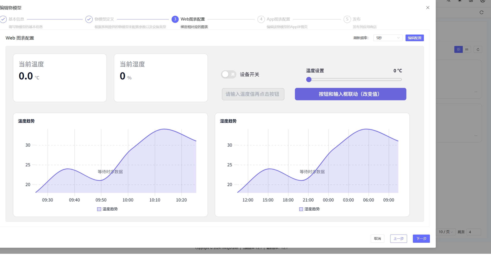
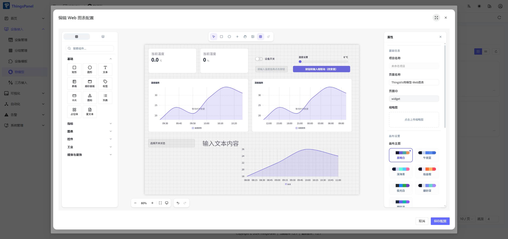
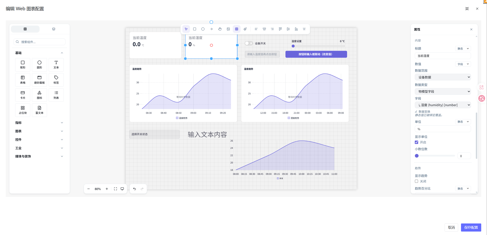
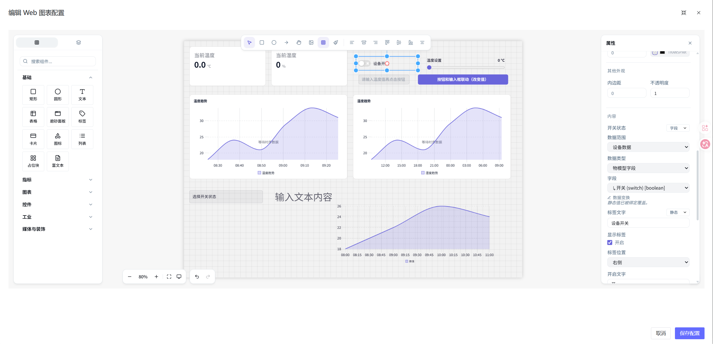

# 物模型

物模型用于定义可复用的设备字段，以及基于这些字段生成的 Web/App 图表页面。设备模板引用物模型后，同一类设备可以复用相同的数据结构和可视化配置。

## 1、说明

- 进入 **设备接入** > **物模型**，打开物模型管理页面。
- 物模型通常对应现实世界中的设备类型，例如温湿度传感器。
- 模型定义包含遥测、属性、事件和命令，这些字段可作为图表配置的数据源。
- Web 图表配置和 App 图表配置均通过 ThingsVis 编辑器创建，并支持保存后预览。
- 保存后的图表配置会应用到使用该物模型的设备详情页。

## 2、操作

### 2.1、创建物模型

- 点击 **新建物模型**。
- 填写名称、标签、作者、版本、说明、图标等基本信息。

### 2.2、定义物模型

- 配置遥测、属性的数据名称、标识符、数据类型、单位、说明和读写设置。
- 当设备需要上报事件或接收平台控制指令时，继续配置事件和命令。
- 保存模型定义后，再进入图表配置步骤。

### 2.3、配置 Web 图表

当前 Web 图表通过内嵌的 ThingsVis 预览和编辑器完成配置。下图以 **物模型配置 DEMO** 为例说明当前流程。

- 在编辑弹窗中进入第 **3 步 Web 图表配置**。
- 在卡片顶部选择刷新频率。DEMO 中当前设置为 **5 秒**。
- 中间区域会以内嵌 ThingsVis 的方式预览当前 Web 图表页面。DEMO 中包含温度趋势、湿度趋势、设备开关、温度设置、当前温度和当前湿度等组件。
- 点击 **编辑配置** 打开 ThingsVis 编辑器。

- 在编辑器中，左侧组件库用于添加组件，中间为画布，右侧属性面板用于配置页面或选中的组件。
- 绑定数据时，从当前物模型字段中选择对应字段，例如 `temperature`、`humidity`、`switch`。
- 点击 **保存配置** 后，页面会保存回 Web 图表配置；如果不保存本次修改，点击 **取消**。
- 保存后会返回 Web 图表预览，确认预览无误后点击 **下一步**。

#### 绑定数据示例

在画布中选中组件，或切换到 **图层** 后按组件名称选择目标组件。选中后，右侧属性面板会显示该组件的数据绑定项。

配置曲线图时，选择 `图表/时序图` 等折线图组件。在 **内容** 中设置标题、图例、X 轴、Y 轴等显示项；在 **数据** 中将数据集绑定模式设为 **字段**，数据范围选择 **设备数据**，数据类型选择 **历史数据**，字段选择 `temperature__history` 或 `humidity__history` 这类历史数组字段。随后按需要设置时间范围、聚合函数、聚合窗口、平滑曲线和面积填充。

配置数值卡片时，选择 `指标/数值`。先设置卡片标题，再将 **数值** 的绑定模式设为 **字段**。数据范围选择 **设备数据**，数据类型选择 **物模型字段**，字段选择 `humidity` 或 `temperature` 等数值字段。根据物模型字段设置单位、是否显示单位、小数位数，也可以按需要开启趋势或图标。

配置开关时，选择 `控制/开关`。将 **开关状态** 的绑定模式设为 **字段**，数据范围选择 **设备数据**，数据类型选择 **物模型字段**，字段绑定到 `switch` 这类布尔字段。然后配置标签文字、标签位置、开启文字、关闭文字、尺寸、颜色，以及禁用、确认后切换等行为选项。

### 2.4、配置 App 图表

App 图表同样使用 ThingsVis 编辑器配置，但会单独保存为移动端 App 详情页配置。

- 进入第 **4 步 App 图表配置**。
- 选择 App 详情页的刷新频率。
- 点击 **创建配置** 或 **编辑配置** 打开编辑器。
- 设计移动端详情页，并将组件绑定到物模型中的遥测或属性字段。
- 点击 **保存配置** 保存 App 图表页面，并返回预览。
- 点击 **下一步** 进入发布步骤。

### 2.5、完成并发布

- 检查物模型基本信息、模型定义、Web 图表配置和 App 图表配置。
- 确认无误后发布物模型。
