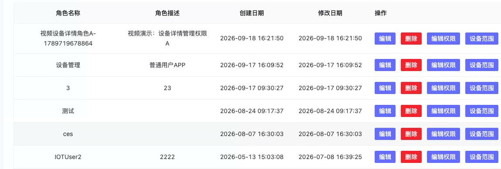

# 角色管理

:::info 版本说明
本文中的租户用户、角色及按设备分配权限适用于企业版。社区版为单租户版本，不提供租户内用户管理和按用户分配设备的能力。
:::

- 角色管理可添加用户、编辑用户、编辑权限、删除用户。

## 编辑权限
- 选择某个角色，点击编辑权限，可以编辑该角色可以看到的左侧菜单、页面和功能权限。
- 角色权限决定用户能否进入设备管理、设备详情以及使用编辑等功能，但不决定用户可以看到哪些具体设备。

## 设备范围权限

- 企业版中，设备数据范围在设备详情的“用户”页配置。将用户关联到设备后，再设置设备权限。
- “管理（含读取）”表示用户可以读取该设备数据并管理该设备。
- 用户只能看到被关联的设备。给用户 A、B 分别关联不同设备并授予“管理（含读取）”后，A、B 可以分别管理自己的设备，且互相看不到对方设备。
