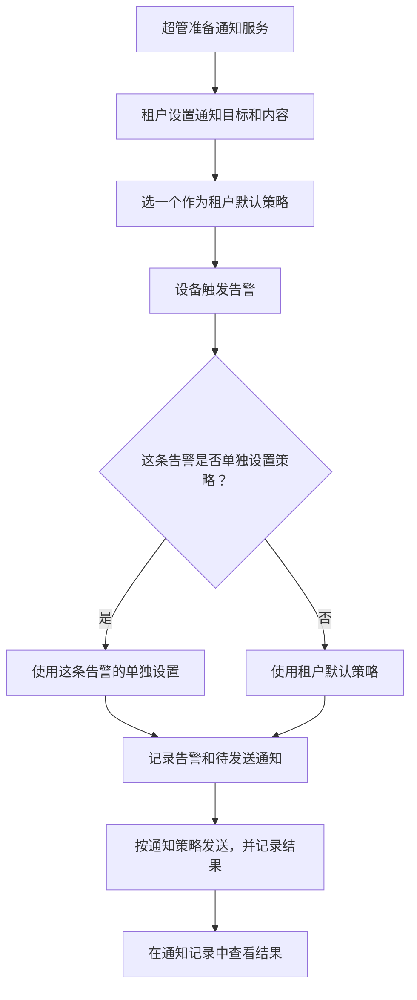

# 通知策略

通知策略就是“发生告警时，用哪个服务、通知谁、发什么”。超管准备好服务和账号，租户设置自己的通知策略。可以为整个租户设一次默认策略，也可以为某条告警单独设置。

## 1. 创建通知策略

1. 打开**告警 → 通知策略**，查看超管提供的可用服务。租户能看见服务名称和支持的通知方式，不能查看或修改服务商密钥。

*页面示例。图中的账号已停用；正式使用时请确认服务处于可用状态。*

2. 点击**新建通知策略**，填写名称，选择服务，设置收件人和消息内容。
3. 保存后重新打开，核对目标和内容。保存、校验配置都不会发送通知。
4. 点击**启用策略**，使它可用于告警。如果启用失败，按照页面提示处理，不能把“保存成功”当作“已经可用”。

## 2. 为整个租户设置默认策略

1. 在**通知策略**页面找到**租户默认通知策略**。
2. 选择一个可用于告警的策略，点击**保存默认策略**，刷新确认选择仍然存在。
3. 创建或编辑告警规则时，通知策略选择**使用租户默认策略**。未单独选择策略的告警会在触发时使用当前默认策略。

*实际页面截图。图中的策略名称为演示名称；保存默认策略不会发送通知。*

例如，把“运维邮箱”设为默认策略后，未单独设置的温度、离线等告警都发到该邮箱。重要设备需要另一组收件人时，只需为那条告警选择其他策略。

- **单独设置优先**：告警规则选了具体策略，就用它，不再使用默认策略。
- **没有默认策略**：告警仍会记录，但不会发送通知。
- **策略停用或失效**：记录原因并停止发送，请处理配置；系统不会自行改用其他策略。
- **修改默认策略**：只影响之后触发的告警，已排队的通知按触发时的设置处理。
- **多人同时修改**：页面会提示配置已变化，刷新核对后再保存，避免覆盖他人的设置。

## 3. 为某条告警单独指定通知方式

打开对应告警规则，在通知策略中选择一个具体策略并保存。想恢复使用默认策略时，改回**使用租户默认策略**后保存。

*实际告警表单。选择“使用租户默认策略”，即可在告警触发时继承默认设置。图中的策略名称是演示数据。*

这一步用于特殊告警，例如普通告警发邮件，重要告警使用另一个通知目标。普通告警无需每条重复配置。

## 4. 发送测试和查看结果

仅在需要时点击**发送测试**，确认目标与内容；它会真实提交给服务商，可能产生费用。测试成功后，还应检查实际收件端。

打开**告警 → 通知记录**查看发送结果。**服务商已受理**表示服务商收下请求，不表示收件人已经收到。SMTP 通常不提供最终送达回执，邮件还可能进入垃圾邮件，请检查收件箱及垃圾邮件。

“记录告警和待发送通知”是先把这次告警与要发送的内容存好，断网或服务重启后还能继续处理。“按通知策略发送，并记录结果”是按所选服务和收件人发送，让您能查到每个目标的处理结果。

## 5. 权限和服务扩展

服务商账号和密钥归超管管理。租户管理本租户的通知策略和默认设置；缺少服务时联系超管。社区版没有租户子用户管理流程。

插件开发者可参考[插件开发指南](../../../developer-guide/notification-plugin.md)扩展服务。
