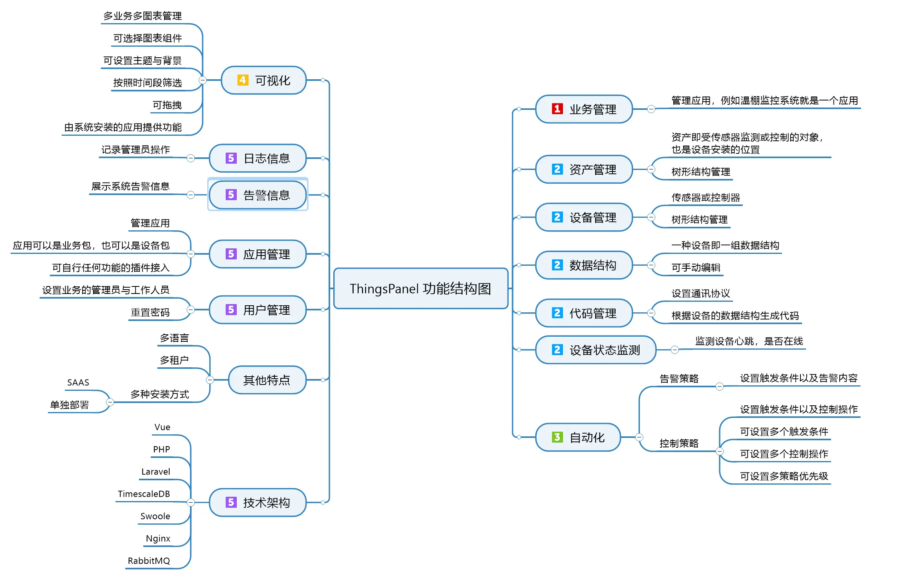

# ThingsPanel-test

物联网核心支撑软件 ・适用所有物联网场景 ・免费、开源AGPLv3 ・简洁、易用 ・功能可无限扩展。

## 产品介绍

- 面向快速实施的物联网方案开发与共享平台，以简单、快速、美观、通用为特点。
- 技术研发人员可以快速构建应用，并将业务打包分发给世界各地的用户以获取收入。
- 对业务人员而言，ThingsPanel不用写代码，一整套方案开箱即用。业务交付时间是传统的物联网方案的30%以下。成本也大幅度降低。
- 可广泛应用于交通、医疗、消费、家居、消防、安防、工业、农业等各个领域。

## 功能结构体

